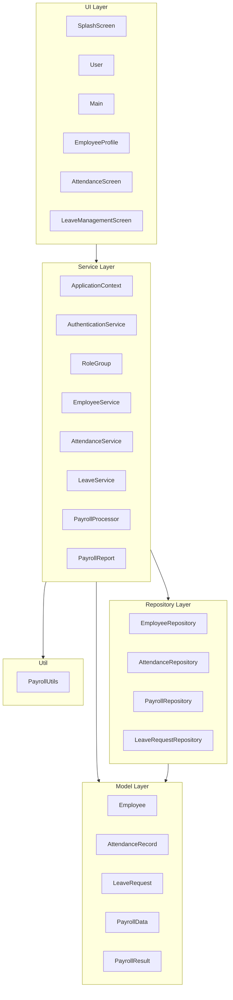

# GEAR.HR Codebase Documentation

Technical and functional documentation for the GEAR.HR Employee Management System. This document describes the application architecture, packages, classes, data persistence, role-based access, and features.

---

## 1. Introduction and Purpose

- **Application name:** GEAR.HR (Employee Management System for MotorPH)
- **Tech stack:** Java, Swing (GUI), CSV file persistence
- **Purpose:** Employee management, attendance tracking, leave requests, payroll computation, and role-based access control. The system uses no database; all data is stored in CSV files under the `csv/` directory.

---

## 2. Application Entry Point and Startup Flow

- **Entry point:** `src/ui/Main.java` — `public static void main(String[] args)`
- **Flow:**
  1. `main()` creates an `ApplicationContext` (composition root).
  2. `SplashScreen.showSplash(...)` is invoked; the splash displays for 2 seconds with a gradient and logo.
  3. The splash callback runs `User.showLoginScreen(null, ctx)`.
  4. User enters credentials; `AuthenticationService.authenticate(userId, password)` validates against `csv/user_credentials.csv`.
  5. On success, `Main.showMainScreen(userId, role, email, ctx)` opens the main dashboard. Role and email come from the credentials file.
- **Dependency injection:** All UI and business logic receive services via `ApplicationContext`. The UI does not create services; they are passed in (e.g. from Main into EmployeeProfile, AttendanceScreen, LeaveManagementScreen).

---

## 3. Architecture Overview

The application follows a layered structure. Dependencies flow from UI down to services, then to repositories and models.

- **UI layer (`ui`):** Frames and panels built with Swing. Calls services only; no direct file or repository access.
- **Service layer (`service`):** Business logic and orchestration. Uses repositories for persistence and model classes for data. `ApplicationContext` is the composition root: it instantiates all repositories and services and exposes them via getters. The main frame and screens receive this context (or specific services) when opened.
- **Repository layer (`repository`):** CSV load and save only. No business rules; each repository knows its file path and CSV format.
- **Model layer (`model`):** Domain entities and DTOs (Employee, AttendanceRecord, LeaveRequest, PayrollData, PayrollResult).
- **Util (`util`):** Stateless helpers. `PayrollUtils` provides static methods for SSS, PhilHealth, Pag-IBIG, and withholding tax calculations.

---

## 4. Package and Class Reference

| Package       | Class                  | Responsibility |
|---------------|------------------------|----------------|
| **model**     | Employee               | Employee entity; immutable `employeeNumber`; personal, work, and payroll-related fields (SSS, PhilHealth, TIN, Pag-IBIG, email, position, address, phone, hourlyRate). |
| **model**     | AttendanceRecord       | Single attendance entry (employeeId, date, status, timeIn, timeOut). Computes hours worked and validity (timeOut after timeIn). |
| **model**     | LeaveRequest           | Leave request (employeeId, startDate, endDate, reason, status). Status one of Pending, Approved, Rejected. Validates date range. |
| **model**     | PayrollData            | Payroll figures per employee (base salary, SSS/PhilHealth/Pag-IBIG amounts, withholding tax, allowances). Immutable; used by PayrollProcessor. |
| **model**     | PayrollResult          | DTO for payroll computation result; consumed by PayrollReport for display and receipt output. |
| **repository**| EmployeeRepository     | Load/save `csv/employees.csv`. |
| **repository**| AttendanceRepository   | Load/save `csv/attendance_records.csv`. |
| **repository**| PayrollRepository      | Load/save `csv/payroll_records.csv`. |
| **repository**| LeaveRequestRepository | Load/save `csv/leave_requests.csv`. |
| **service**   | ApplicationContext     | Composition root; creates all repositories and services; provides getters for each service. |
| **service**   | AuthenticationService  | Loads `csv/user_credentials.csv`; `authenticate(userId, password)`; `getRoleAndEmail(userId)`. |
| **service**   | RoleGroup              | Enum: HR, PAYROLL, NORMAL. `fromRole(role)` maps role string from credentials to group. |
| **service**   | EmployeeService        | CRUD employees; delegates persistence to EmployeeRepository. |
| **service**   | AttendanceService      | Add, get, remove attendance records; clearAll(); uses AttendanceRepository. |
| **service**   | LeaveService           | Add, get, update status of leave requests; uses LeaveRequestRepository. |
| **service**   | PayrollProcessor       | getPayrollData, updatePayrollData, processPayroll(employee, month); uses PayrollRepository and PayrollUtils. |
| **service**   | PayrollReport          | format(PayrollResult) for on-screen display and .txt receipt download. |
| **util**      | PayrollUtils           | Static: calculateSSSAmount, calculatePhilHealthAmount, calculatePagIbigAmount, calculateWithholdingTax. |
| **ui**        | SplashScreen           | Animated splash (gradient, logo); 2s then invokes callback. |
| **ui**        | User                   | Login window; credentials via AuthenticationService; on success opens Main. |
| **ui**        | Main                   | Main dashboard: sidebar (role-based) and content panel (gradient, logo, copyright). Collapsible "Personal Account" and "Directives" for HR/Payroll; flat buttons for Normal. Logout at bottom. |
| **ui**        | EmployeeProfile        | Employee list (HR/Payroll) or single "My Profile" (Normal); view/edit employee; salary computation; payroll receipt download; Edit Payroll only for Payroll group. |
| **ui**        | AttendanceScreen       | Record/view attendance; validations (date yyyy-MM-dd, time HH:mm, timeIn ≤ timeOut; On Leave/Absent no times). HR: full manage; Payroll: view only; Normal: my attendance only. |
| **ui**        | LeaveManagementScreen  | Submit leave (reason required); view list; HR: change status (Pending/Approved/Rejected); Payroll: view only; Normal: my leave only. |

---

## 5. Data Persistence (CSV)

- **Directory:** All data files live under `csv/`.
- **Files and formats:**

| File                    | Header | Used by |
|-------------------------|--------|---------|
| user_credentials.csv    | userId,password,role,email | AuthenticationService |
| employees.csv           | EmployeeNumber,LastName,FirstName,SSS,PhilHealth,TIN,PagIBIG,Email,Position,Address,Phone | EmployeeRepository, EmployeeService |
| attendance_records.csv  | EmployeeID,Date,Status,TimeIn,TimeOut | AttendanceRepository, AttendanceService |
| payroll_records.csv     | EmployeeID,BaseSalary,SSSAmount,PhilHealthAmount,PagIBIGAmount,WithholdingTax,RiceSubsidy,PhoneAllowance,ClothingAllowance | PayrollRepository, PayrollProcessor |
| leave_requests.csv      | EmployeeID,StartDate,EndDate,Reason,Status | LeaveRequestRepository, LeaveService |

- Dates in CSV use ISO format `yyyy-MM-dd` where applicable (e.g. leave StartDate, EndDate).
- **Note:** The employee profile UI and EmployeeService use `employees.csv`. A file `100employees.csv` may exist in `csv/` as legacy or sample data; the application’s employee profile and list use `employees.csv`.

---

## 6. Role-Based Access Control (RBAC)

- **Source of role:** After login, the role and email are read from `user_credentials.csv`. The role string is mapped to a group via `RoleGroup.fromRole(role)`.
- **Groups:**

  - **HR:** Roles: HR Manager, HR Team Leader, HR Rank and File.  
    Sidebar: collapsible **Personal Account** (My Attendance, My Profile, My Payroll, My Leave) and **Directives** (Attendance Management, Employee Profile, Leave Management).  
    Can manage employees (add/update/delete), attendance (record, clear), and leave status (Pending/Approved/Rejected). **Cannot** edit payroll; can only view, compute salary, and download payroll receipt.

  - **Payroll:** Roles: Payroll Manager, Payroll Team Leader, Payroll Rank and File, Account Team Leader, Account Rank and File.  
    Sidebar: **Personal Account** (same four options) and **Directives** (Payroll Management, View Attendance, View Leave Requests).  
    Can edit payroll; attendance and leave are view-only.

  - **Normal:** All roles not in HR or Payroll.  
    Sidebar: My Attendance, My Profile, My Payroll, My Leave (no Directives section).  
    All screens show only the current user’s data; no edit payroll, no leave approval, no managing other employees’ attendance.

- **Collapsible sections:** For HR and Payroll, "Personal Account" and "Directives" start **collapsed** at login. The user expands each section to see and use the buttons.

---

## 7. Key Features and Validations

- **Login:** User ID and password; role and email loaded from credentials. Invalid credentials show an error message; success opens Main with userId, role, and email.
- **Attendance:** Date must be `yyyy-MM-dd`; time must be `HH:mm`; timeIn must not be after timeOut. For status "On Leave" or "Absent", time In/Out are not required and are stored empty. Duplicate (same employeeId + date) is prevented. Invalid input triggers popup messages with brief instructions.
- **Leave:** Reason is required; start and end date are validated; status is one of Pending, Approved, Rejected (only HR can change status).
- **Payroll:** Computation is by month; SSS, PhilHealth, Pag-IBIG, and withholding tax use `PayrollUtils`. Receipt can be downloaded as a .txt file (content from `PayrollReport.format`).

---

## 8. UI Flow Summary

1. **SplashScreen** → displayed for 2 seconds → callback opens **User** (login).
2. **User** → successful login → **Main** (dashboard with sidebar and content panel).
3. From **Main**, the user opens one of: **EmployeeProfile**, **AttendanceScreen**, **LeaveManagementScreen**, depending on role and which sidebar option is chosen (Personal Account vs Directives, and which action).
4. Each screen receives the needed services (from ApplicationContext) and `RoleGroup`/userId to enforce RBAC (e.g. filtering to own data for Normal, hiding Edit Payroll for HR).
5. Closing or navigating back from a sub-screen returns to Main (or closes the opened frame); Main remains the central dashboard.

---

## 9. External Assets and Configuration

- **Logo/icon:** `Logo/Icon.png` is used as the frame icon by Main and User (optional; missing file is handled without failing).
- **Font:** "Garet" is used in the UI where specified (e.g. sidebar labels and buttons).
- **Colors:** Consistent theme across login and main screen: dark header (e.g. #222222), white text on dark, orange accent for primary buttons (e.g. #FF991C), blue gradient (e.g. #5DE0E6 to #004AAD) for content/background panels.

---

## 10. Conventions and How to Run

- **Naming:** Packages are lowercase; classes use PascalCase. Repositories have names ending in Repository, services in Service; UI classes use Screen or Profile as appropriate.
- **Dependencies:** No Maven or Gradle; the project uses standard Java and Swing only. All source is under `src/` with packages model, repository, service, util, ui.
- **How to run:** Compile all sources under `src/` (including model, repository, service, util, ui). Run the main class `ui.Main`. The working directory must contain the `csv/` folder (with the required CSV files); `Logo/Icon.png` is optional.
