# GEAR.HR Refactoring: Steps and Processes

This document records the refactoring steps and processes applied to transform the GEAR.HR application from a procedural-style codebase into an object-oriented, layered design. It is intended for maintainers, auditors, and future developers who need to understand what was changed and in what order.

**Reference:** Refactoring was driven by the design in `OOP.txt` and by several implementation plans (initial OOP refactor, OOP refinement, home page GUI, role-based access, etc.). The current architecture is described in `CODEBASE_DOCUMENTATION.md`.

---

## Before State

**Original structure:**

- **Login (User)** and **main dashboard (Main)** had mixed responsibilities; Main pulled role/email from User or from shared state.
- **EmployeeProfile** and **Attendance** combined GUI, in-memory state (employee list, attendance map), and direct CSV I/O. No dedicated domain models or services.
- **SalaryComputation** was a separate payroll module with its own PayrollData and CSV handling; payroll logic was not unified with a single reporting path.
- There were **no formal packages**; classes lived in the default package or ad-hoc locations. Role and email were used at login but were not classified into groups for access control.

**Goals of refactoring:**

- Separate backend (domain, services, persistence) from GUI.
- Introduce domain models and services so that business rules and data access are in one place.
- Centralize persistence (CSV paths and formats) and support a repository layer.
- Support role-based access (HR, Payroll, Normal Employee) with three homepages and per-screen restrictions.
- Improve testability and maintainability so that new features (e.g. payroll rules, leave policies) can be added without touching GUI classes.

---

## Part I: Initial OOP Refactor (Backend and Domain)

**Source:** Initial OOP refactor plan (e.g. gearhr_oop_refactor).

### 1. Introduce core domain models

**Goal:** Define clear domain entities without changing GUI behavior.

**Steps:**

- **model.Employee** was created with fields from existing usage (employeeNumber, name, position, SSS, PhilHealth, TIN, Pag-IBIG, email, address, phone, hourlyRate). Validated getters/setters were implemented; identity (employeeNumber) was intended to be set only in the constructor where possible.
- **model.AttendanceRecord** was created to represent a single day entry: employeeId, date, status, timeIn, timeOut. Logic for computing hours worked and validating time-out after time-in was encapsulated in the model.
- **model.LeaveRequest** was created with employeeId, startDate, endDate, reason, and status. Validation for date range (start before or equal to end) and allowed status values (Pending, Approved, Rejected) was applied in setters or factory methods.
- **model.PayrollData** and **model.PayrollResult** were created to carry payroll figures (base salary, deductions, allowances) and the computed result for a given employee and month, so that PayrollProcessor and PayrollReport could work with structured data instead of raw strings.

**Files created:** `src/model/Employee.java`, `src/model/AttendanceRecord.java`, `src/model/LeaveRequest.java`, `src/model/PayrollData.java`, `src/model/PayrollResult.java`.

**Outcome:** A single place for domain rules and data shapes; GUI and services were later refactored to use these types.

### 2. Extract backend services

**Goal:** Move business logic and persistence out of GUI classes into dedicated service classes.

**Steps:**

- **AuthenticationService:** Credential loading was moved from User into a new class. It reads `user_credentials.csv` (with a fallback path if the file was not yet under `csv/`). It exposes `authenticate(userId, password)` (returning an Employee or null) and `getRoleAndEmail(userId)` (returning role and email). User.java was reduced to GUI only and calls this service for login and role/email.
- **EmployeeService:** The employee list and CSV persistence were moved out of EmployeeProfile. The service holds the in-memory list, exposes getAllEmployees(), findEmployeeById(), addEmployee(), updateEmployee(), deleteEmployee(), and delegates load/save to CSV (later to EmployeeRepository).
- **AttendanceService:** The attendance map and all CSV I/O were moved out of the Attendance GUI. The service manages records by composite key (employeeId + date), exposes addRecord(), getAllRecords(), hasRecord(), removeAttendanceRecords(), clearAll(), and persists via CSV (later AttendanceRepository).
- **PayrollProcessor and PayrollReport:** SalaryComputation was refactored or replaced. PayrollProcessor handles loading/saving payroll data, getPayrollData(employeeId), updatePayrollData(), and processPayroll(employee, month) using PayrollUtils for SSS, PhilHealth, Pag-IBIG, and tax. PayrollReport.format(PayrollResult) was introduced to format the breakdown for display. One code path for payroll computation and reporting was established.
- **LeaveService:** An in-memory list of LeaveRequest was introduced; methods addLeaveRequest(), getAllLeaveRequests(), getLeaveRequestsByEmployee(), updateLeaveRequestStatus() were added. Persistence to a leave_requests CSV was implemented (later delegated to LeaveRequestRepository).

**Files created/updated:** `src/service/AuthenticationService.java`, `src/service/EmployeeService.java`, `src/service/AttendanceService.java`, `src/service/PayrollProcessor.java`, `src/service/PayrollReport.java`, `src/service/LeaveService.java`. GUI classes (User, Main, EmployeeProfile, Attendance) were updated to call these services instead of performing I/O or holding domain state.

**Outcome:** Backend services owned all business logic and persistence; GUI only invoked services and displayed results.

### 3. Wire GUI to backend

**Steps:**

- User was updated to use AuthenticationService for login. On success, it obtained userId, role, and email (from the service or from the authenticated Employee) and passed them to Main.showMainScreen(...).
- Main, EmployeeProfile, and Attendance were updated to receive or resolve service instances (initially via static fields or parameters) and to delegate all business logic and persistence to them. No direct CSV access or static maps for domain data remained in UI classes.

**Outcome:** Clear separation: UI handles input/output and navigation; services handle rules and data.

### 4. Leave management backend

**Steps:**

- The LeaveRequest model and LeaveService were implemented with in-memory storage and CSV persistence (e.g. leave_requests.csv). Validation for date range and status was applied. No dedicated Leave GUI was added in this phase.

**Outcome:** Leave feature was ready for a dedicated UI screen to be added later.

---

## Part II: OOP Refinement (Packaging, DI, Single Payroll, Leave UI, Repositories, Naming)

**Source:** OOP refinement plan (oop_refinement_plan).

### 1. Package the UI

**Goal:** Explicit separation of UI from model and service via Java packages.

**Steps:**

- Package `ui` was created under `src`. User, Main, EmployeeProfile, Attendance, and SplashScreen were moved into `ui/` and given `package ui;`. All imports in these files and in any class that referenced them (e.g. Main opening User, Attendance, EmployeeProfile) were updated. The application entry point was confirmed runnable as `ui.Main`. PayrollUtils and service/model classes were placed in named packages (`util`, `service`, `model`) so that UI could import them.

**Files affected:** All moved GUI classes; Main and any other references. Model, service, and util classes were given packages if they were not already packaged.

**Outcome:** Layout `model/`, `service/`, `ui/` (and later `repository/`, `util/`).

### 2. Dependency injection

**Goal:** No UI class constructs services; a single composition root provides all dependencies.

**Steps:**

- **ApplicationContext** was introduced in `service/`. It instantiates all services (and later all repositories) and exposes getters (getAuthenticationService(), getEmployeeService(), getAttendanceService(), getPayrollProcessor(), getLeaveService()). In `Main.main` or the splash callback, the context was created once and passed into `User.showLoginScreen(null, ctx)`. After login, Main.showMainScreen(userId, role, email, ctx) was called; Main used the context to obtain services and passed the required ones into EmployeeProfile.showProfileScreen(...), Attendance.showAttendanceScreen(...), and later LeaveManagementScreen.showLeaveScreen(...). Static service fields in UI classes were removed or replaced by parameters; each screen received the services it needed as arguments.

**Files created/updated:** `src/service/ApplicationContext.java`; `src/ui/User.java`, `src/ui/Main.java`, `src/ui/EmployeeProfile.java`, `src/ui/AttendanceScreen.java` (and later `src/ui/LeaveManagementScreen.java`).

**Outcome:** Testable, swappable dependencies; a single place to configure services.

### 3. Single source of truth for payroll

**Goal:** Remove duplicate payroll logic; only PayrollProcessor and PayrollReport should own computation and formatting.

**Steps:**

- The codebase was searched for any references to SalaryComputation. All callers were switched to PayrollProcessor.processPayroll(employee, month) and PayrollReport.format(result). SalaryComputation.java was removed (and its inner PayrollData if duplicated by model.PayrollData). EmployeeProfile and any other callers were updated to use only PayrollProcessor and model.PayrollData / model.PayrollResult.

**Files removed/updated:** SalaryComputation.java was deleted; `src/ui/EmployeeProfile.java` (and any other callers) were updated.

**Outcome:** One payroll computation and report path.

### 4. Leave management UI

**Goal:** Expose LeaveService through a dedicated screen.

**Steps:**

- **LeaveManagementScreen** was added in package `ui`. It lists leave requests in a table (employee ID, start date, end date, reason, status), provides a form to create a request (employee, start/end date, reason; status default Pending), and controls to update status (Pending/Approved/Rejected). It uses LeaveService and optionally EmployeeService for employee dropdowns. A "Leave Management" button or card was added on the Main dashboard to open this screen; Main passes LeaveService and EmployeeService (as needed) into showLeaveScreen(...). Existing UI patterns (colors, fonts, buttons) were reused for consistency.

**Files created/updated:** `src/ui/LeaveManagementScreen.java`; `src/ui/Main.java` was updated to add navigation and pass LeaveService (and EmployeeService if needed).

**Outcome:** Leave requests are viewable, creatable, and status-updatable from the GUI.

### 5. Repository layer

**Goal:** Separate CSV I/O from business logic so that services focus on rules and repositories on persistence.

**Steps:**

- Package `repository` was created. **EmployeeRepository**, **AttendanceRepository**, **PayrollRepository**, and **LeaveRequestRepository** were added; each implements load() and save() for the corresponding CSV file. Services were refactored to accept a repository in the constructor and to delegate all file I/O to the repository; services retained validation and in-memory state. ApplicationContext was updated to create repository instances and inject them into the services (e.g. new EmployeeService(employeeRepository)).

**Files created/updated:** `src/repository/EmployeeRepository.java`, `src/repository/AttendanceRepository.java`, `src/repository/PayrollRepository.java`, `src/repository/LeaveRequestRepository.java`; all services that persist data; `src/service/ApplicationContext.java`.

**Outcome:** Repositories handle CSV I/O; services handle business logic and orchestration.

### 6. Naming and encapsulation

**Goal:** Clear naming and stable entity identity.

**Steps:**

- The Attendance UI class was renamed to **AttendanceScreen**; all references (e.g. in Main) were updated to AttendanceScreen.showAttendanceScreen(...). In model.Employee, employeeNumber was made set-only in the constructor (setEmployeeNumber was removed or restricted) so that the entity identity remains stable.

**Files updated:** Attendance.java was renamed to AttendanceScreen.java; `src/ui/Main.java` and any other references; `src/model/Employee.java`.

**Outcome:** Consistent naming (AttendanceScreen = UI; AttendanceService / AttendanceRecord = backend); stronger encapsulation for Employee.

---

## Part III: Data and Paths (CSV Organization)

**Goal:** A single folder for all CSV data; all classes that read or write CSV use the new paths.

**Steps:**

- A `csv/` directory was created in the project root. user_credentials.csv, employees.csv (and/or 100employees.csv initially), attendance_records.csv, payroll_records.csv, and leave_requests.csv were moved (or copied and then removed from the root) into `csv/`. AuthenticationService and all repository classes were updated to use paths under `csv/` (e.g. `csv/user_credentials.csv`, `csv/employees.csv`, `csv/attendance_records.csv`, `csv/payroll_records.csv`, `csv/leave_requests.csv`). User, EmployeeProfile, and AttendanceScreen were verified to still work via services/repositories pointing to the new paths. EmployeeRepository was configured to use `csv/employees.csv` for profile data where applicable.

**Files updated:** All repository classes; `src/service/AuthenticationService.java`; optionally `src/repository/EmployeeRepository.java` for employees.csv.

**Outcome:** Centralized data directory; no CSV files scattered in the project root for application use.

---

## Part IV: Home Page GUI (Sidebar and Gradient Content)

**Source:** Home page sidebar GUI plan.

**Goal:** Replace the three-card layout with a sidebar (WEST) and a gradient content panel (CENTER); remove header/footer strips; show logo, user email, role, and copyright in the content area.

**Steps:**

- In Main, the header and footer panels were removed. **createSidebarPanel** was added: a vertical layout (e.g. BoxLayout.Y_AXIS) with three buttons—Attendance Management, Employee Profile, Leave Management—each invoking the same actions as before (opening the corresponding screen with the required services). A new **content panel** was created that paints the blue gradient (same GradientPaint as before) and displays the logo (`Logo/3.png`), user email, role label, and copyright. The main panel structure was set to WEST = sidebar panel, CENTER = gradient content panel. createFeatureCard, createHeaderPanel, createFooterPanel, and related helpers were removed or repurposed.

**Files modified:** `src/ui/Main.java` only.

**Outcome:** Sidebar navigation and gradient content panel with logo, email, role, and copyright.

---

## Part V: Sidebar Refinements and Role Display Fix

**Steps:**

- **Button size and font:** Sidebar button height and font size were reduced so that labels fit and the layout is compact (e.g. smaller font, reduced preferred or maximum height).
- **Logout to sidebar:** The "File" menu and "Logout" menu item were removed from the menu bar. A "Logout" button was added at the bottom of the sidebar with the same logout action (confirm dialog and then open User login screen).
- **Email and role to sidebar:** User email and role were moved from the gradient content panel to the top of the sidebar: email above role; email in bold, role in a smaller font.
- **Role/position display fix:** Credential array indexing in AuthenticationService was corrected so that role (position) and email are read correctly from user_credentials.csv. The stored array was defined as `{ password, role, email }` and accessed as cred[1] for role and cred[2] for email (and passed to Main) so that the role label displays the correct value on the home page.

**Files modified:** `src/ui/Main.java`; `src/service/AuthenticationService.java` for credential indices and getRoleAndEmail/authenticate return values.

**Outcome:** Sidebar contains user info at top, navigation buttons, and Logout at bottom; role displays correctly.

---

## Part VI: Validations and Feature Additions

**Steps:**

- **Attendance validations:** In AttendanceScreen (and any service validation used by it), the following were enforced: date format Year-Month-Day (e.g. yyyy-MM-dd); time format (e.g. HH:mm) and the rule that time-in must not be later than time-out; for status "On Leave" and "Absent", time in/out input was disabled or cleared and no time in/out was stored in the record. Popup error messages with brief instructions were shown when validation failed. Duplicate records (same employee and date) were prevented.
- **Employee profile data source:** The employee profile screen (and EmployeeService/EmployeeRepository) was switched to use `csv/employees.csv` instead of `csv/100employees.csv` so that the profiles screen uses the same dataset as the rest of the application.
- **Payroll receipt download:** In the salary computation area of EmployeeProfile, a "Download Receipt" (or similar) button was added. The payroll report text is generated via PayrollReport.format(result) and the user can save it as a .txt file (e.g. via JFileChooser).
- **Leave reason required:** In LeaveManagementScreen, a non-empty reason was required before a leave request could be submitted; an error message was shown if the reason was missing.

**Files modified:** `src/ui/AttendanceScreen.java`, `src/ui/EmployeeProfile.java`, `src/ui/LeaveManagementScreen.java`; `src/repository/EmployeeRepository.java` path if not already using employees.csv.

**Outcome:** Robust input validation, consistent data source for profiles, payroll receipt export, and leave reason enforced.

---

## Part VII: Role-Based Access Control (RBAC)

**Source:** Role-based homepage plan.

**Steps:**

- **RoleGroup and classification:** **RoleGroup** enum (HR, PAYROLL, NORMAL) was added in package `service` with a static method `fromRole(String role)` that maps role strings from user_credentials to a group. HR roles: "HR Manager", "HR Team Leader", "HR Rank and File". Payroll roles: "Payroll Manager", "Payroll Team Leader", "Payroll Rank and File", "Account Team Leader", "Account Rank and File". All other roles map to NORMAL.
- **Three homepages in Main:** In showMainScreen, `RoleGroup group = RoleGroup.fromRole(role)` was computed. Three sidebar variants were built: **HR** (Attendance Management, Employee Profile, Leave Management); **Payroll** (Payroll Management, View Attendance, View Leave Requests); **Normal** (My Attendance, My Profile, My Payroll, My Leave). Each button opens the same screen classes but passes `group` (and userId, role, ctx) so screens can self-restrict.
- **Screen-specific restrictions:**  
  - **EmployeeProfile:** HR = full list and full edit (add/delete employee, edit profile); Payroll = payroll-only (edit payroll, no add/delete employee, no edit profile fields); Normal = single-employee view (own profile, read-only).  
  - **AttendanceScreen:** HR = full manage (record for any, edit, delete); Payroll = view only (table visible, record form hidden or disabled); Normal = my attendance only (employee fixed to current user, record for self, view own records, no edit/delete of existing records).  
  - **LeaveManagementScreen:** HR = full (submit for any, change status); Payroll = view only; Normal = submit own only, view own requests only, no status change.  
  - **Payroll (inside EmployeeProfile):** Initially HR and Payroll could edit; Normal view-only.
- **HR payroll restriction (refinement):** HR was restricted so they cannot edit payroll. They can only view, compute salary, and print/download receipt. The "Edit Payroll" button was hidden or disabled for HR in EmployeeProfile; only the Payroll group can edit payroll.

**Files created/updated:** `src/service/RoleGroup.java`; `src/ui/Main.java`; `src/ui/EmployeeProfile.java`; `src/ui/AttendanceScreen.java`; `src/ui/LeaveManagementScreen.java`.

**Outcome:** Three distinct homepages; per-screen access and restrictions; HR cannot edit payroll.

---

## Part VIII: Personal Account and Directives (Collapsible Sections)

**Goal:** For HR and Payroll, add the same four "My" options as Normal (My Attendance, My Profile, My Payroll, My Leave) as an additional set of actions; group these under "Personal Account" and group directive actions under "Directives"; use collapsible sections (not dropdowns).

**Steps:**

- In Main, for HR and Payroll sidebars, two collapsible sections were added. **"Personal Account"** (header with expand/collapse toggle) contains four buttons: My Attendance, My Profile, My Payroll, My Leave. Each opens the corresponding screen with RoleGroup.NORMAL so the user gets "my only" behavior. **"Directives"** (header with expand/collapse toggle) contains the role-specific buttons: for HR—Attendance Management, Employee Profile, Leave Management; for Payroll—Payroll Management, View Attendance, View Leave Requests. Collapse/expand was implemented with a toggle (e.g. arrow or label); the content panel visibility was toggled on header click. Both sections were configured to start **collapsed** at login.

**Files modified:** `src/ui/Main.java` only.

**Outcome:** HR and Payroll have both "Personal Account" (four My-* buttons) and "Directives" (role-specific buttons); both are collapsible and start closed.

---

## Part IX: Documentation

**Steps:**

- **CODEBASE_DOCUMENTATION.md** was created in the project root. It describes the current application: architecture (layers, composition root), packages and classes, data persistence (CSV paths and formats), RBAC (groups and access matrix), key features and validations, UI flow, and how to run. It is reference-only; no application code was changed for it.
- **OOP_UPDATED.txt** was created as a copy of OOP.txt with content updated to reflect the current GEAR.HR implementation (packages, dependency injection, repositories, UI structure, RBAC) so that the academic OOP paper matches the as-built system.

**Outcome:** Two documentation artifacts: one technical (CODEBASE_DOCUMENTATION.md), one academic (OOP_UPDATED.txt).

---

## Summary

| Part | Main goal | Key files touched |
|------|-----------|-------------------|
| I    | Domain models and backend services; GUI wired to services; leave backend | model/*.java, service/AuthenticationService, EmployeeService, AttendanceService, PayrollProcessor, PayrollReport, LeaveService; User, Main, EmployeeProfile, Attendance |
| II   | Package UI; dependency injection; single payroll path; Leave UI; repository layer; rename Attendance, Employee identity | ui/*.java, service/ApplicationContext.java, repository/*.java, model/Employee.java; SalaryComputation removed |
| III  | Centralize CSV under csv/ | All repository classes, AuthenticationService |
| IV   | Sidebar + gradient content on home page | Main.java |
| V    | Sidebar refinements (button size, Logout, email/role, role display fix) | Main.java, AuthenticationService.java |
| VI   | Attendance validations; employees.csv for profile; payroll receipt download; leave reason required | AttendanceScreen, EmployeeProfile, LeaveManagementScreen, EmployeeRepository |
| VII  | Role-based access (RoleGroup, three homepages, screen restrictions, HR no edit payroll) | RoleGroup.java, Main, EmployeeProfile, AttendanceScreen, LeaveManagementScreen |
| VIII | Personal Account and Directives collapsible for HR/Payroll; start collapsed | Main.java |
| IX   | Technical and academic documentation | CODEBASE_DOCUMENTATION.md, OOP_UPDATED.txt |

---

## Refactoring phases (high-level)

```mermaid
flowchart LR
  A[Domain models] --> B[Backend services]
  B --> C[GUI wire-up]
  C --> D[Package UI]
  D --> E[DI and ApplicationContext]
  E --> F[Single payroll path]
  F --> G[Leave UI]
  G --> H[Repository layer]
  H --> I[CSV organization]
  I --> J[Home GUI sidebar]
  J --> K[Sidebar refinements]
  K --> L[RBAC and RoleGroup]
  L --> M[Personal Account and Directives]
  M --> N[Documentation]
```

This sequence reflects the order in which the refactoring was planned and implemented. Some steps (e.g. repository layer and CSV organization) may have been done in a slightly different order in practice, but the document captures the full set of changes and their outcomes.
