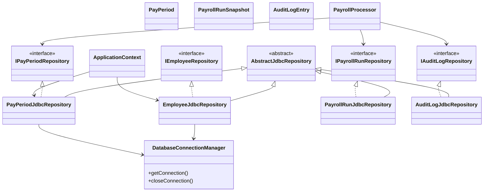
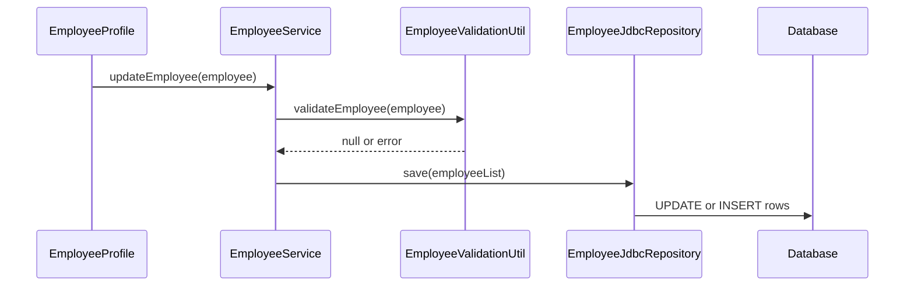
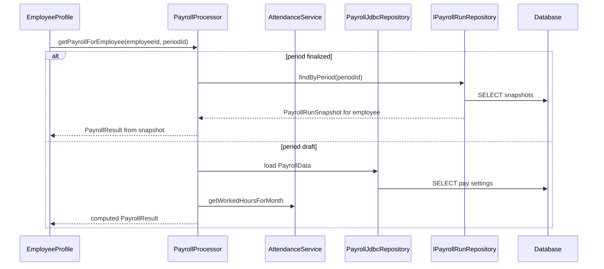
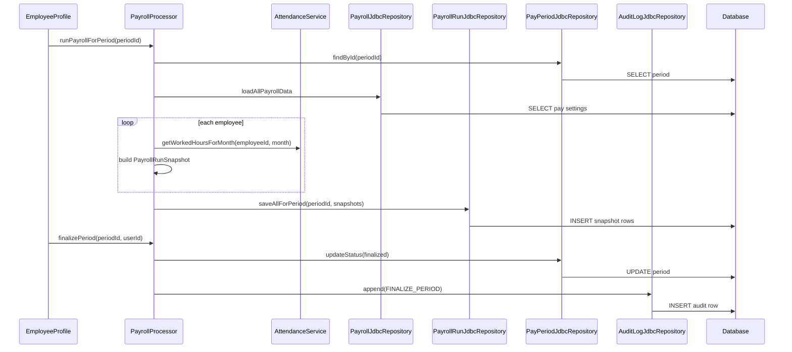
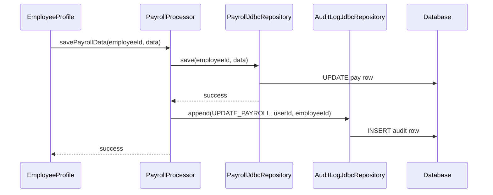

# HM4: Proposing Persistence Updates to Design Artifacts

This document is my individual **Persistence Design Updates Log** for GEAR.HR. It proposes additive changes to our group’s design artifacts—CRC cards, class diagram, and sequence diagrams—so persistence (database storage via JDBC) and payroll expansion from [HM3](HM3.md) can be discussed and merged into the team’s official design log. The proposals align with [HM1: Pre-Connection Planning](HM1.md), which established the need to move off scattered files, and with HM3, which planned pay periods, batch payroll runs, reports, and audit on top of a database foundation.

The codebase today still uses CSV-backed repository classes. These proposals do **not** remove the repository pattern or delete existing CSV types; they add JDBC implementations of the same interfaces and new repositories for HM3 concepts, with `ApplicationContext` wiring the JDBC versions when the group adopts them. Changes are meant to be **minimal and additive** so services and screens keep their responsibilities.

---

## Persistence Direction Summary

We keep the layered shape described in [Architecture-Overview](Architecture-Overview.md): screens call services; services enforce rules and call repository **interfaces**; repositories handle load and save only. Storage shifts from files to a **SQL database connected through JDBC** (HM1 and HM3 Phase 1). HM3 additions—pay periods, frozen payroll run results per employee per period, and audit entries—gain new domain types and matching repository interfaces with JDBC implementations, introduced after core employee, attendance, leave, payroll, credential, and ticket data can persist in the database.

---

## CRC Card Updates

Each row lists the artifact, the proposed responsibility or collaborator change, and the rationale. Collaborators are named where the homework expects them on CRC cards.

### Group A — Connection and JDBC repositories (HM1 Phase 1)

| Artifact (class) | Proposed responsibility / collaborator change | Rationale |
|------------------|-----------------------------------------------|-----------|
| `DatabaseConnectionManager` **(new)** | Open and close JDBC connections; supply a connection to repositories. **Collaborators:** JDBC driver, connection configuration. | HM1: one organized store. Centralizes connection setup so every repository does not duplicate JDBC boilerplate. |
| `AbstractJdbcRepository` **(new)** | Template for JDBC repositories: shared query execution and row-mapping helpers; subclasses provide entity-specific SQL. **Collaborators:** `DatabaseConnectionManager`. | Mirrors `AbstractCsvListRepository` so the team changes storage mechanism, not architectural habit. |
| `EmployeeJdbcRepository` **(new)** | Implement `IEmployeeRepository`: load all, save list, find by id via JDBC. **Collaborators:** `DatabaseConnectionManager`, `Employee`. | HM1: employee directory in database; services keep using `IEmployeeService` / `IEmployeeRepository`. |
| `AttendanceJdbcRepository` **(new)** | Implement `IAttendanceRepository` via JDBC. **Collaborators:** `DatabaseConnectionManager`, `AttendanceRecord`. | Attendance hours remain required for payroll (HM3 batch run). |
| `LeaveRequestJdbcRepository` **(new)** | Implement `ILeaveRequestRepository` via JDBC. **Collaborators:** `DatabaseConnectionManager`, `LeaveRequest`. | Leave data stays in the same store as employees and pay. |
| `UserCredentialJdbcRepository` **(new)** | Implement `IUserCredentialRepository` via JDBC. **Collaborators:** `DatabaseConnectionManager`, `UserCredential`. | Login and roles must persist with the rest of HR data. |
| `ItTicketJdbcRepository` **(new)** | Implement `IItTicketRepository` via JDBC. **Collaborators:** `DatabaseConnectionManager`, `ItTicket`. | Parity with existing ticket module; same swap pattern. |
| `PayrollJdbcRepository` **(new)** | Implement `IPayrollRepository` (employee id → `PayrollData`) via JDBC. **Collaborators:** `DatabaseConnectionManager`, `PayrollData`. | HM1 sensitive pay settings; prerequisite for batch computation. |
| `ApplicationContext` | Wire JDBC repository implementations instead of CSV concrete classes at startup; optional factory or flag to select backend during migration. **Collaborators:** all `I*Repository` interfaces, JDBC concrete repos, services. | Single composition-root change; UI and services stay unchanged. |
| `AbstractCsvListRepository` / existing CSV repos | **No removal.** Mark as legacy or fallback during migration; responsibilities unchanged. | Homework 4: minimal change—add JDBC, do not rip out working CSV design yet. |

### Group B — HM3 expansion (new domain + repositories)

| Artifact (class) | Proposed responsibility / collaborator change | Rationale |
|------------------|-----------------------------------------------|-----------|
| `PayPeriod` **(new domain)** | Represent month/year, status (draft, reviewed, finalized), finalizedBy, finalizedAt; validate status transitions. **Collaborators:** `Validatable`. | HM3 workflow: one closed book per month. |
| `PayrollRunSnapshot` **(new domain)** | Store frozen per-employee pay result for a period: employeeId, periodId, gross, deductions, allowances, net, hoursUsed. **Collaborators:** `PayPeriod`, `Employee` (by id). | HM3: finalized history must not change when live rates change. |
| `AuditLogEntry` **(new domain)** | Store userId, timestamp, targetEmployeeId (optional), actionType (e.g. UPDATE_PAYROLL, FINALIZE_PERIOD). **Collaborators:** none required on card beyond persistence repo. | HM3 audit minimum; append-only log. |
| `IPayPeriodRepository` **(new interface)** | Contract: findById, save, listByStatus. | Separates period persistence from payroll computation. |
| `PayPeriodJdbcRepository` **(new)** | Implement `IPayPeriodRepository` via JDBC. **Collaborators:** `DatabaseConnectionManager`, `PayPeriod`. | Persists period lifecycle for batch and finalize flows. |
| `IPayrollRunRepository` **(new interface)** | Contract: saveAllForPeriod(periodId, snapshots), findByPeriod(periodId). | HM3 batch run stored as many rows per period. |
| `PayrollRunJdbcRepository` **(new)** | Implement `IPayrollRunRepository` via JDBC. **Collaborators:** `DatabaseConnectionManager`, `PayrollRunSnapshot`. | Enables company-wide register and employee view of finalized pay. |
| `IAuditLogRepository` **(new interface)** | Contract: append(entry); findByEmployee or findByPeriod (read for oversight). | HM3 accountability without overloading payroll tables. |
| `AuditLogJdbcRepository` **(new)** | Implement `IAuditLogRepository` via JDBC. **Collaborators:** `DatabaseConnectionManager`, `AuditLogEntry`. | Append-only audit trail in database. |

### Group C — Service layer (minimal additions)

| Artifact (class) | Proposed responsibility / collaborator change | Rationale |
|------------------|-----------------------------------------------|-----------|
| `PayrollProcessor` | Add: run payroll for all employees for a period; load snapshots for a period; finalize period (update status, trigger audit). **Collaborators:** `IPayrollRepository`, `IAttendanceService`, `IPayPeriodRepository`, `IPayrollRunRepository`, `IAuditLogRepository`. | HM3 batch run and finalize stay in service layer, not UI. |
| `PayrollReport` | Add: format payroll register from list of `PayrollRunSnapshot`; format deduction summary for a period. **Collaborators:** `PayrollRunSnapshot`. | HM3 reports without bloating screen classes. |
| `PayrollProcessor` or `EmployeeService` | After successful pay-setting save or period finalize, call `IAuditLogRepository.append`. **Collaborators:** `IAuditLogRepository`. | HM3 audit tied to real business events, not UI clicks alone. |
| `EmployeeProfile`, other UI modules | **No new persistence responsibilities.** Continue to call services only. | Persistence stays out of screens per existing design. |

---

## Class Diagram Updates

**Artifact:** Class diagram (see [Architecture-Overview](Architecture-Overview.md), section 7).

**Proposed changes (additive):**

1. Add domain classes: `PayPeriod`, `PayrollRunSnapshot`, `AuditLogEntry`.
2. Add repository interfaces: `IPayPeriodRepository`, `IPayrollRunRepository`, `IAuditLogRepository`.
3. Add persistence support: `DatabaseConnectionManager`, `AbstractJdbcRepository`, and concrete `*JdbcRepository` classes implementing existing and new interfaces.
4. Show `ApplicationContext` depending on JDBC implementations instead of CSV classes when database mode is active.
5. **Attributes (minimal):** `PayPeriod` holds month, year, status, finalizedBy, finalizedAt; `PayrollRunSnapshot` holds periodId, employeeId, monetary fields, hoursUsed. Prefer existing string business keys (employee number, period id) over adding `db_id` to every current `AbstractEntity` subclass, to limit churn.

**Rationale:** Diagram reflects HM1 storage swap and HM3 new persisted concepts without redrawing the entire model layer. Services still depend on interfaces, not concrete JDBC types.

---

## Sequence Diagram Updates

Base flows are from [Architecture-Overview](Architecture-Overview.md), section 11. Below: artifact name, proposed update, and rationale.

### Update 1 — Employee update (persistence via JDBC)

**Artifact:** Sequence diagram — Employee update (HR / IT).

| Proposed update | Rationale |
|-----------------|-----------|
| Replace participant `EmployeeRepository` with `EmployeeJdbcRepository`. | Same interface contract; JDBC backing store (HM1). |
| Replace participant `employees.csv` with `Database`. | Data lives in SQL, not a file write. |
| Keep flow: UI → `EmployeeService` → validation → repository save. | Minimal change to message order. |
| Optional note on diagram: use a transaction when saving employee plus related rows in future combined operations. | Supports consistent multi-table updates later; not required for single-employee save v1. |

---

### Update 2 — Payroll view (employee)

**Artifact:** Sequence diagram — Payroll view (employee).

| Proposed update | Rationale |
|-----------------|-----------|
| Replace `PayrollRepository` with `PayrollJdbcRepository`; add `Database` participant. | HM1: pay settings from database. |
| Add branch: if period is **finalized**, `PayrollProcessor` calls `loadSnapshotsForPeriod` and returns snapshot-based result; else existing live compute using attendance hours. | HM3: employee sees official closed-month pay, not a recalculation that drifted after finalize. |

---

### Update 3 — Batch payroll run and finalize period (new)

**Artifact:** Sequence diagram — **new** flow for HM3 payroll office.

| Proposed update | Rationale |
|-----------------|-----------|
| New interaction from `EmployeeProfile` (or future payroll management screen) through `PayrollProcessor` to period repo, payroll data repo, attendance, run repo, audit repo, and database. | HM3 batch run + finalize + audit in one coherent flow. |
| Loop over employees for computation; single `saveAllForPeriod` to database. | Efficient month-end; exceptions surfaced before finalize. |
| `finalizePeriod` updates period status and appends audit entry. | HM3 workflow and accountability. |

---

### Update 4 — Audit on pay setting update (new)

**Artifact:** Sequence diagram — **new** short flow for pay edits.

| Proposed update | Rationale |
|-----------------|-----------|
| After `PayrollJdbcRepository` successfully saves pay settings, `PayrollProcessor` (or service handling save) calls `AuditLogJdbcRepository.append` with UPDATE_PAYROLL. | HM3 minimum audit; only log after successful persist. |

---

## Self-Reflection Checklist

### Clarity of responsibility placement

Persistence responsibilities stay on repository classes and `DatabaseConnectionManager`; services orchestrate load, compute, save, and audit append; UI modules only call services. Audit is written after a successful save or finalize, not from the screen directly. That matches our existing CRC split and keeps JDBC out of domain entities except as data they do not know about.

### Alignment with HM1 and HM3

HM1 called for a database instead of files—proposed JDBC repositories implement that without changing service contracts. HM3 called for periods, batch runs, snapshots, reports, and audit—new domain types and repositories plus `PayrollProcessor` and `PayrollReport` extensions cover those needs. HR view-only payroll is unchanged: no new edit rights on CRC cards for HR roles. No proposal contradicts the phased order (database first, then periods and batch, then reports and audit).

### Functionality and minimal change

Every existing `I*Repository` can gain a JDBC implementation rather than rewriting `EmployeeService`, `AttendanceService`, or screens. CSV repositories can remain during migration. New interfaces are limited to period, run snapshot, and audit—only what HM3 requires beyond the current six data areas. Field-level audit diffs are deferred per HM3’s realistic v1 scope.

### Readiness for group discussion

Tables list artifact, change, and rationale in a form easy to copy into the team **Persistence Design Updates Log**. Sequence diagrams are ready to merge into the group’s interaction diagrams. Open items are explicit so the team can decide together before implementation.

---

## Open Questions for the Team

- Which database product will we use for coursework (MySQL, PostgreSQL, H2, or other)?
- Will we provide a one-time import from existing CSV seed data, or re-enter data after schema creation?
- Should finalized pay periods block edits to live pay settings for that month, or only block re-running batch without an override role?
- Do we use explicit transactions on finalize and batch save only, or on every repository call?

---

## How This Document Helps

HM4 turns HM1 and HM3 narrative plans into concrete, discussable updates for CRC cards, the class diagram, and sequence diagrams. It preserves GEAR.HR’s layered design and repository interfaces while proposing JDBC storage and HM3 payroll persistence. The group can adopt, modify, or reject each row in discussion; implementation in code is a separate step. This file is my individual proposal layer—not yet merged into [CRC-and-Method-Dictionary](CRC-and-Method-Dictionary.md)—so teammates can compare and integrate persistence changes without ambiguity about what changed and why.
