# GEAR.HR — Architectural Overview (Updated)

GEAR.HR is a **layered desktop application** built with **Java Swing**. It manages employees, attendance, leave, payroll, user credentials, and IT tickets. This document describes our **target architecture**: primary persistence is **MySQL via JDBC**, with HM3 payroll expansion (pay periods, batch runs, frozen snapshots, audit, reports). CSV files under `csv/` remain as **legacy seed/fallback** during migration.

The UI adapts navigation and permissions by **role group** (`HR`, `Payroll`, `IT/Admin`, or normal employee).

**Baseline (current code):** [Architecture-Overview.md](Architecture-Overview.md) — CSV-only. **Design artifacts:** [CRC-and-Method-Dictionary-Updated.md](CRC-and-Method-Dictionary-Updated.md). **Planning:** [Payroll System Expansion Planning.md](Payroll%20System%20Expansion%20Planning.md), [Persistence Design Revision Log.md](Persistence%20Design%20Revision%20Log.md), [HM3.md](HM3.md), [HM4.md](HM4.md).

---

## 1. Architectural style

The codebase follows a **classic three-tier layout** adapted for a single-process desktop app:

| Layer | Package | Responsibility |
|-------|---------|----------------|
| **Presentation** | `ui` | Swing screens, forms, tables, navigation; calls services through `ApplicationContext` |
| **Business / application** | `service` | Use cases, validation orchestration, auth, payroll computation, role mapping |
| **Persistence** | `repository` | Load/save domain data to **MySQL via JDBC**; no business rules. `DatabaseConnectionManager` supplies connections; `*JdbcRepository` implements `I*Repository`. CSV repos optional fallback. |
| **Domain** | `model` | Entities, value objects, `Identifiable` / `Validatable` contracts |
| **Cross-cutting helpers** | `util` | Stateless validation and payroll math used by model and service layers |

There is **no network API** for HR use cases (desktop-only). **Target:** a local or course MySQL database accessed through JDBC. The composition root [`ApplicationContext`](../src/service/ApplicationContext.java) will wire **JDBC** repository implementations by default (planned); services and UI depend on `I*Repository` interfaces only (manual dependency injection).


---

## 2. Layer diagram

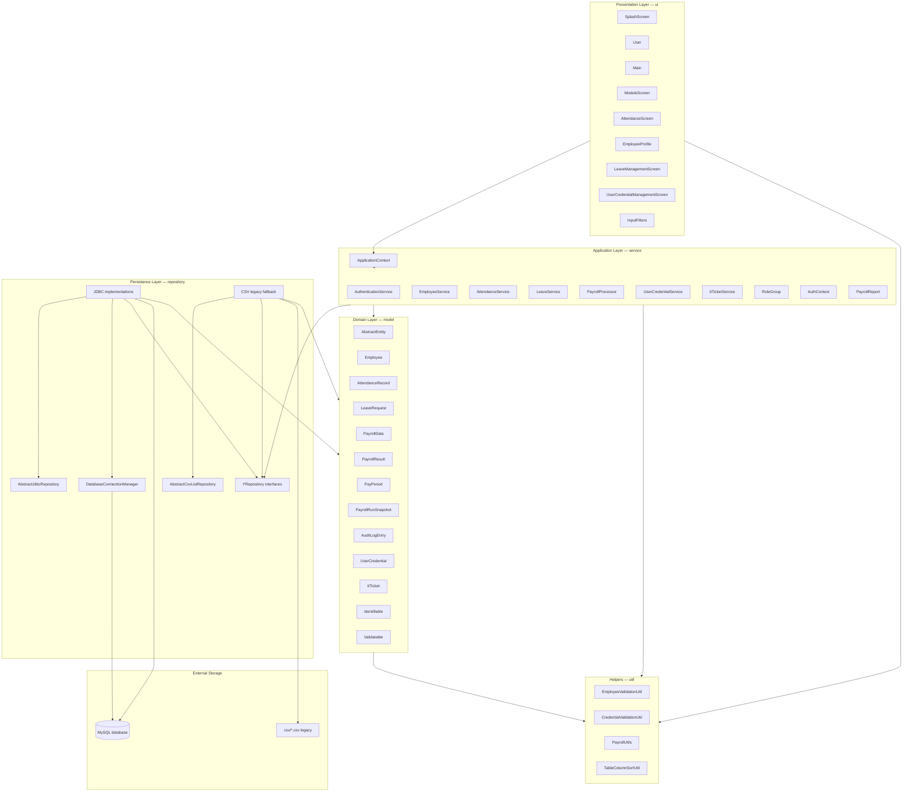

**Dependency rule:** `ui` → `service` → `repository` → `model`. `util` is depended on by `model`, `service`, and `ui` but does not depend on them. `repository` does not depend on `service` or `ui`.

---

## 3. Package structure

```
GEAR.HR/
├── csv/                          # Legacy seed data (6 CSV files); optional fallback
├── sql/                          # (Planned) schema.sql, migration scripts
├── docs/                         # Documentation
├── src/
│   ├── model/          (~13 types) Domain + PayPeriod, PayrollRunSnapshot, AuditLogEntry
│   ├── repository/     (~28 types) I*Repository + JDBC repos + CSV legacy + connection mgr
│   ├── service/        (~17 types) Services, ApplicationContext, RoleGroup enum
│   ├── ui/             (10 types)  Screens, Main, ModuleScreen, InputFilters
│   └── util/           (4 types)   Validation, payroll formulas, table sorting
└── README.md
```

Entry point: [`Main.main`](../src/ui/Main.java) → splash → login → role-based dashboard.

---

## 4. Component diagram (major types)

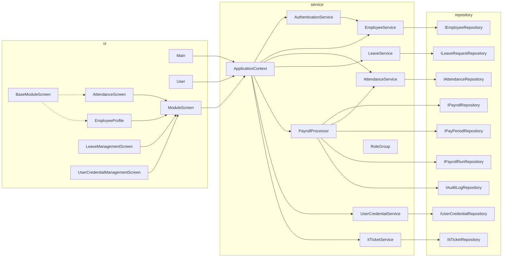

`ApplicationContext` is the **only** place that instantiates repositories and services. UI classes receive `ApplicationContext` via `ModuleScreen.show(...)` or login/dashboard helpers.

---

## 5. Application startup and navigation

### Startup sequence

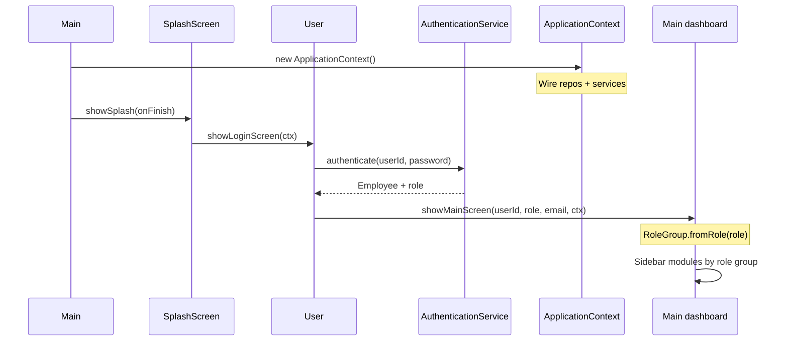

### Opening a module

`Main` opens feature screens through the **`ModuleScreen`** interface (polymorphism). Each module implements `show(parentFrame, userId, role, group, ctx)` and pulls the services it needs from `ctx`.

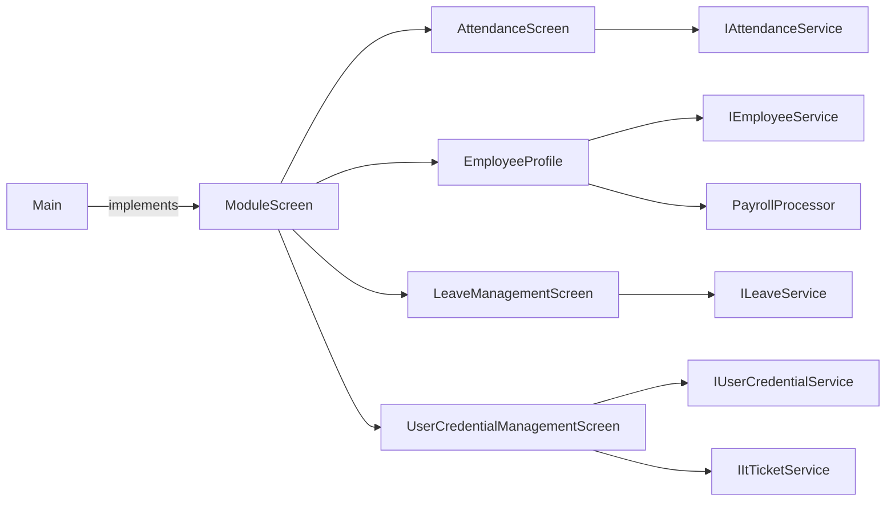

When JDBC is active (planned), login loads credentials from MySQL via `UserCredentialJdbcRepository` instead of CSV.

---

## 6. Persistence architecture

### Target: MySQL (primary)

| Table (planned) | Repository | Domain type |
|-----------------|------------|-------------|
| `employees` | `EmployeeJdbcRepository` | `Employee` |
| `attendance_records` | `AttendanceJdbcRepository` | `AttendanceRecord` |
| `leave_requests` | `LeaveRequestJdbcRepository` | `LeaveRequest` |
| `payroll_settings` | `PayrollJdbcRepository` | `Map<String, PayrollData>` |
| `user_credentials` | `UserCredentialJdbcRepository` | `UserCredential` |
| `it_tickets` | `ItTicketJdbcRepository` | `ItTicket` |
| `pay_periods` | `PayPeriodJdbcRepository` | `PayPeriod` |
| `payroll_run_snapshots` | `PayrollRunJdbcRepository` | `PayrollRunSnapshot` |
| `audit_log` | `AuditLogJdbcRepository` | `AuditLogEntry` |

`DatabaseConnectionManager` opens JDBC connections to MySQL. Concrete repositories extend **`AbstractJdbcRepository`** (template for shared query/row-mapping); subclasses implement entity-specific SQL.

**Composition root:** `ApplicationContext` wires JDBC implementations by default. An optional flag may select CSV repos during migration.

**Transactions (provisional):** coordinated commits on `saveAllForPeriod` and `finalizePeriod` so snapshots and period status stay consistent.

### Repository pattern (JDBC)

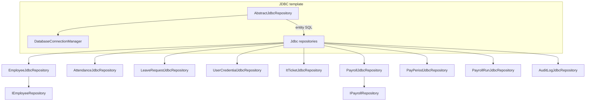

Services call **`I*Repository`** only; they do not know whether JDBC or CSV is wired.

### Legacy: CSV files

| File | Repository | Domain type |
|------|------------|-------------|
| `csv/employees.csv` | `EmployeeRepository` | `Employee` |
| `csv/attendance_records.csv` | `AttendanceRepository` | `AttendanceRecord` |
| `csv/leave_requests.csv` | `LeaveRequestRepository` | `LeaveRequest` |
| `csv/payroll_records.csv` | `PayrollRepository` | `Map<String, PayrollData>` |
| `csv/user_credentials.csv` | `UserCredentialRepository` | `UserCredential` |
| `csv/ITtickets.csv` | `ItTicketRepository` | `ItTicket` |

### Repository pattern

Most list-based repos extend **`AbstractCsvListRepository<T>`**, which implements:

- `load()` — read file, skip header, parse lines via subclass hooks
- `save(List<T>)` — write header + rows via `toCsvRow`

Subclasses supply: `getFilePath()`, `getHeader()`, `parseLine()`, `toCsvRow()`.

**Exception:** `PayrollRepository` implements `IPayrollRepository` directly and persists a **`Map<String, PayrollData>`** (employee ID → payroll row), not a `List`.

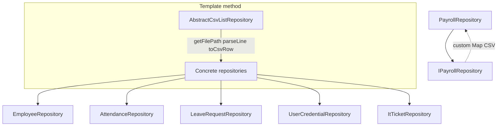

Services typically **load into memory** on use, mutate collections, then **save** back to CSV (e.g. `EmployeeService.loadEmployeesFromCSV` / `saveEmployeesToCSV`).

---

## 7. Domain model

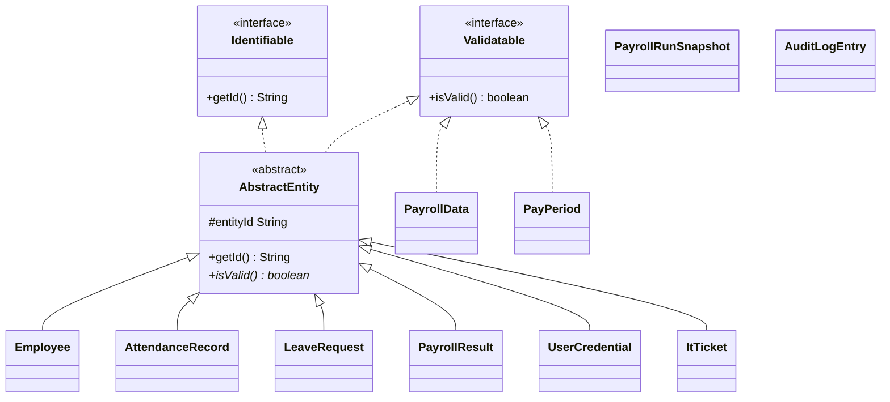

- **`AbstractEntity`** — shared ID and abstract validation; subclasses implement `isValid()`.
- **`PayrollData`** — payroll configuration per employee; implements `Validatable` only (keyed by employee ID in storage).
- **`PayrollResult`** — computed payroll breakdown for display (live run or mapped from snapshot).
- **`PayPeriod`** *(planned)* — month/year, status (draft → reviewed → finalized), finalizedBy, finalizedAt. String business key (e.g. `2026-05`).
- **`PayrollRunSnapshot`** *(planned)* — frozen per-employee pay for a period; links periodId + employeeId.
- **`AuditLogEntry`** *(planned)* — append-only action log for pay edits and finalization.
- **`AuthContext`** — immutable post-login context (not an entity; lives in `service`).

We prefer **string business keys** (employee number, period id) over adding surrogate `db_id` to every existing entity, to limit migration churn.

Format validation for employees and credentials is delegated to **`EmployeeValidationUtil`** and **`CredentialValidationUtil`**.

---

## 8. Service layer (use cases)

| Service | Primary responsibility | Key dependencies |
|---------|------------------------|------------------|
| `AuthenticationService` | Load credentials, authenticate user, resolve `AuthContext` | `EmployeeService` (implicit via employee lookup) |
| `EmployeeService` | CRUD employees, CSV sync, duplicate checks | `IEmployeeRepository`, `IUserCredentialService` |
| `AttendanceService` | Attendance CRUD, monthly hours for payroll | `IAttendanceRepository` |
| `LeaveService` | Leave requests, overlap checks, status updates | `ILeaveRequestRepository` |
| `PayrollProcessor` | Load/save payroll; compute pay; **(planned)** batch run per period, finalize period, snapshot branch, audit append | `IPayrollRepository`, `IAttendanceService`, `IPayPeriodRepository`, `IPayrollRunRepository`, `IAuditLogRepository` |
| `UserCredentialService` | Admin credential CRUD, sync with new employees | `IUserCredentialRepository`, `IAuthenticationService` |
| `ItTicketService` | IT ticket CRUD | `IItTicketRepository` |
| `PayrollReport` | Format `PayrollResult`; **(planned)** register and deduction summary from snapshots | (static helper, no state) |

**Payroll computation flow (draft period):** UI → `PayrollProcessor.getPayrollForEmployee` → load `PayrollData` + attendance hours → **`PayrollUtils`** / `PayrollData` → **`PayrollResult`**.

**Payroll computation flow (finalized period):** same entry point → load **`PayrollRunSnapshot`** for employee/period → map to **`PayrollResult`** (no live recalculation).

**Month-end flow (planned):** `runPayrollForPeriod` → loop employees, build snapshots → `saveAllForPeriod` → review → `finalizePeriod` + audit → reports via **`PayrollReport`**.

---

## 9. Role-based access control

Roles are **strings** in `user_credentials.csv`. [`RoleGroup`](../src/service/RoleGroup.java) maps them to four groups:

| Group | Example roles | Extra UI (Directives) |
|-------|---------------|------------------------|
| `HR` | HR Manager, HR Team Leader, HR Rank and File | Attendance Management, Employee Profile, Leave Management |
| `PAYROLL` | Payroll Manager, Account Team Leader, … | Payroll Management, View Attendance, View Leave Requests |
| `IT_ADMIN` | IT, IT Operations and Systems | Attendance, Employee Profile & Payroll, Leave, Credential/IT admin |
| `NORMAL` | Any other role | Personal modules only (attendance, profile, leave) |

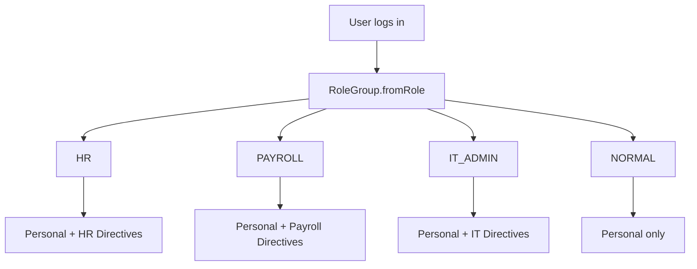

Fine-grained rules (e.g. HR can view but not edit payroll) are enforced **inside UI classes** such as `EmployeeProfile` and `AttendanceScreen`, using the `RoleGroup` passed into `show(...)`.

**HM3 controls (planned):** batch payroll run and **finalize period** are limited to **Payroll** and **IT/Admin** roles; HR may review reports and period status but not finalize or edit pay figures.

---

## 10. Design patterns and OOP themes

| Pattern / principle | Where it appears |
|---------------------|------------------|
| **Layered architecture** | `ui` / `service` / `repository` / `model` |
| **Repository** | `I*Repository` + JDBC implementations (CSV legacy) |
| **Template method** | `AbstractCsvListRepository` (CSV), `AbstractJdbcRepository` (JDBC, planned) |
| **Transaction boundary** | Batch save + finalize period (provisional) |
| **Dependency injection (manual)** | `ApplicationContext` composition root |
| **Interface segregation** | `IEmployeeService`, `IAttendanceService`, etc. |
| **Strategy / polymorphism** | `ModuleScreen` — `Main` opens any module uniformly |
| **Abstract base class** | `AbstractEntity`, `BaseModuleScreen` |
| **Factory** | `RoleGroup.fromRole(String)` |
| **DTO / value object** | `PayrollResult`, `AuthContext`, `PayrollData` |
| **Utility / facade** | `InputFilters`, validation utils, `PayrollUtils` |

Coursework Javadoc tags (`[ABSTRACTION]`, `[POLYMORPHISM]`, `[INHERITANCE]`, `[ENCAPSULATION]`, `[INTERFACE]`) mark intentional OOP teaching points throughout the source.

---

## 11. Typical request flows

### Employee update (HR / IT) — JDBC

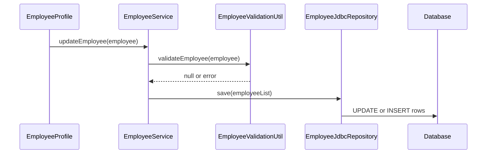

### Payroll view (employee) — finalized vs draft

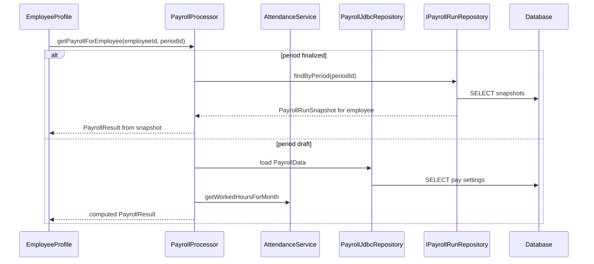

### Batch payroll run and finalize period (planned)

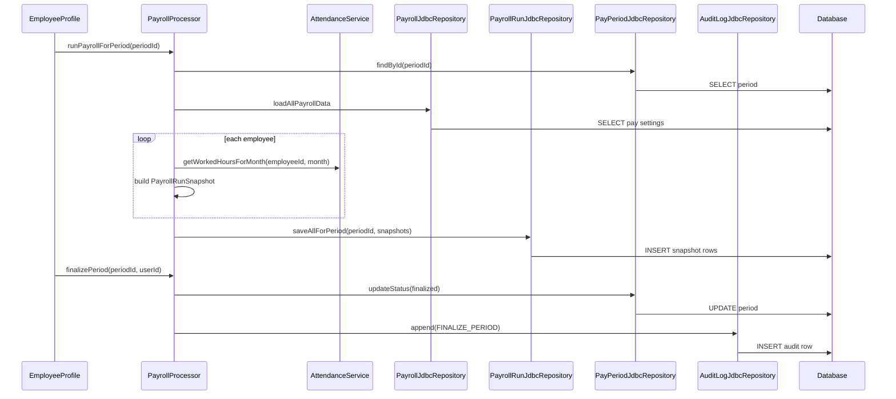

### Audit on pay setting update (planned)

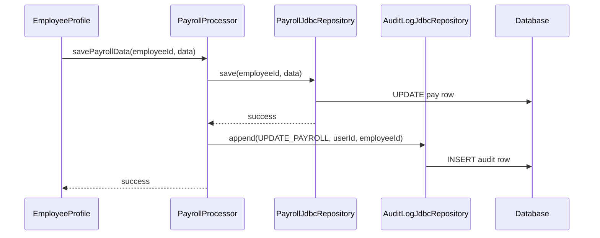

---

## 12. Boundaries and limitations

- **Single-user desktop:** Still one Swing process; MySQL provides a shared source of truth but we have not designed multi-user locking in the UI.
- **MySQL required (target):** Application needs a running MySQL instance and connection configuration (credentials not stored in repo).
- **Migration:** CSV seed import strategy and schema details are provisional (see section 16).
- **No formal build tool** in-repo: compile/run from IDE with `src` as source root.
- **Legacy CSV:** `csv/` remains for seed/fallback; relative paths assume project root as working directory.
- **IT ticket repository:** `ApplicationContext` can fall back to a no-op `IItTicketRepository` if ticket repo fails to load (defensive bootstrap).
- **Testing:** No automated test suite; behavior validated manually through the Swing UI.
- **Current code gap:** Repository layer in `src` is still CSV-only until JDBC implementation milestone.

---

## 13. Extension points

To extend the system without rewriting the UI shell:

1. **New storage** — Implement `I*Repository` with JDBC (or swap CSV/JDBC in `ApplicationContext`).
2. **New module** — Implement `ModuleScreen`, register navigation in `Main` for the appropriate `RoleGroup`(s).
3. **New business rule** — Add or extend a `service` class; keep SQL/file I/O in `repository`.
4. **New entity** — Add `model` class, `I*Repository` + `*JdbcRepository`, service methods, optional UI.

**Phased rollout (HM3):** database first → pay periods + batch run → reports → audit. See section 15.

---

## 14. Quick reference — file to layer

| Source path | Layer |
|-------------|-------|
| `src/ui/*.java` | Presentation |
| `src/service/*.java` | Application / business |
| `src/repository/*.java` | Persistence (planned: `*JdbcRepository`, `DatabaseConnectionManager`) |
| `src/model/*.java` | Domain |
| `src/util/*.java` | Shared helpers |
| `sql/*.sql` | Schema / migration (planned) |
| `csv/*.csv` | Legacy seed / fallback data |

---

## 15. Planned payroll expansion (HM3)

| Phase | Focus | Key types / flows |
|-------|--------|-------------------|
| **1 — Data foundation** | MySQL + JDBC for six core areas | `DatabaseConnectionManager`, `*JdbcRepository`, `ApplicationContext` wiring |
| **2 — Pay periods & batch** | Named periods, company-wide run | `PayPeriod`, `runPayrollForPeriod`, exception list before finalize |
| **3 — Reports** | Payroll office outputs | `PayrollReport.formatPayrollRegister`, deduction summary |
| **4 — Audit & controls** | Accountability on edits and finalize | `AuditLogEntry`, append after save/finalize |

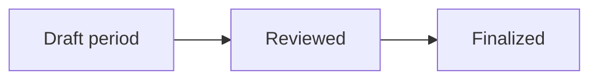

Employees see personal pay aligned with the **finalized** snapshot; HR reviews status and reports; payroll staff own edits, batch run, and finalize.

---

## 16. Design status and open questions

**Status:** This document and [CRC-and-Method-Dictionary-Updated.md](CRC-and-Method-Dictionary-Updated.md) describe the **target** design. The running app in `src` still uses CSV repositories per [Architecture-Overview.md](Architecture-Overview.md).

**Open questions for implementation:**

- Exact MySQL schema (string business keys vs surrogate IDs).
- One-time CSV import vs manual re-entry after schema creation.
- Export format for payroll register (PDF, CSV export, print-only).
- Period status labels and whether HR “reviewed” is a separate approval step.
- Finalized period rules: block live pay edits vs block re-run only.
- Transaction scope: finalize/batch only vs every repository call.
- Field-level audit vs action-type-only v1.
- New payroll office UI module vs extending `EmployeeProfile` tabs.
