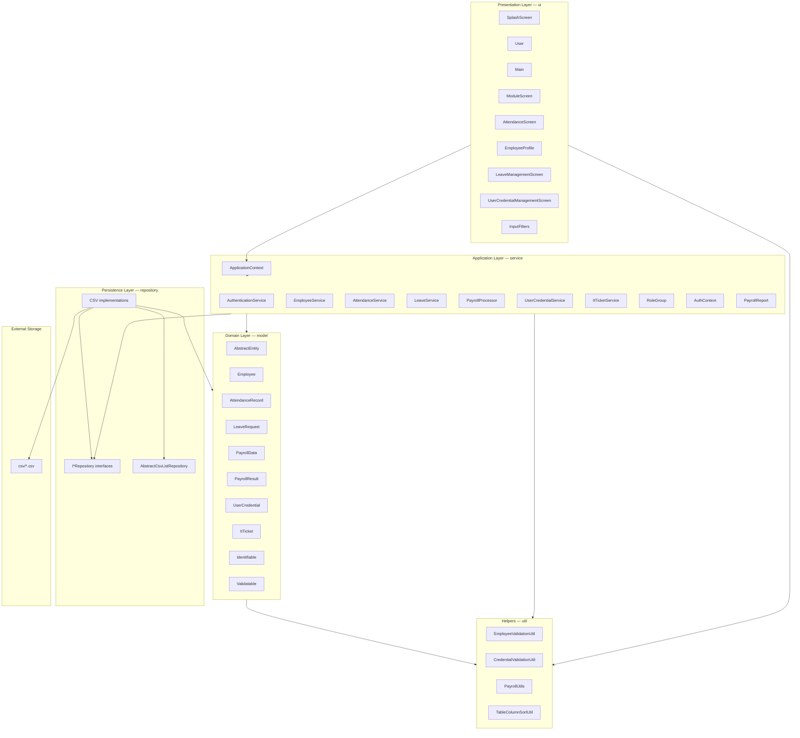
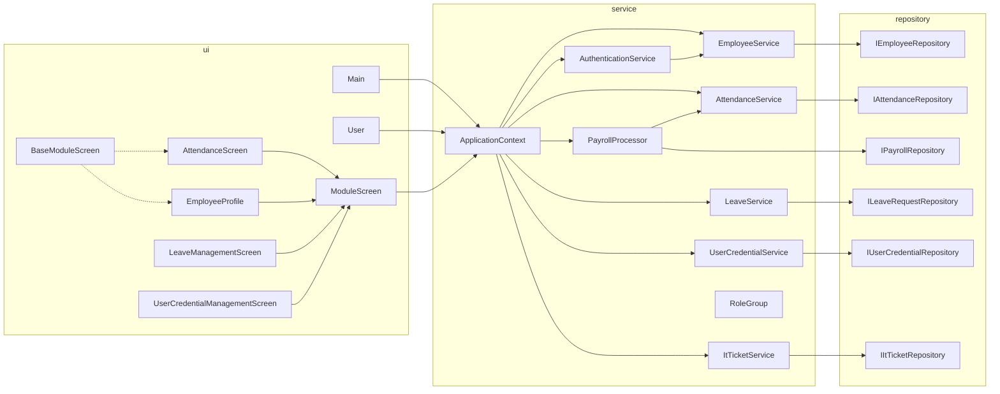
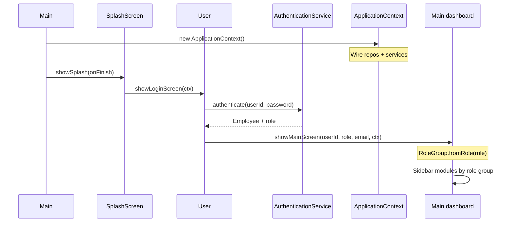
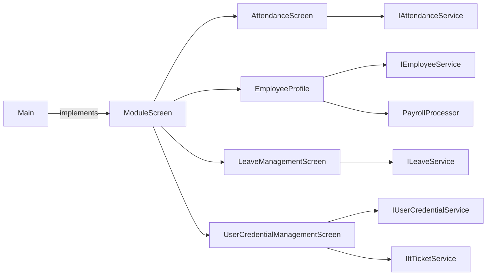
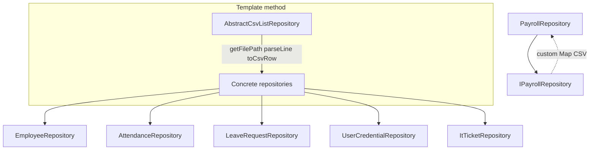
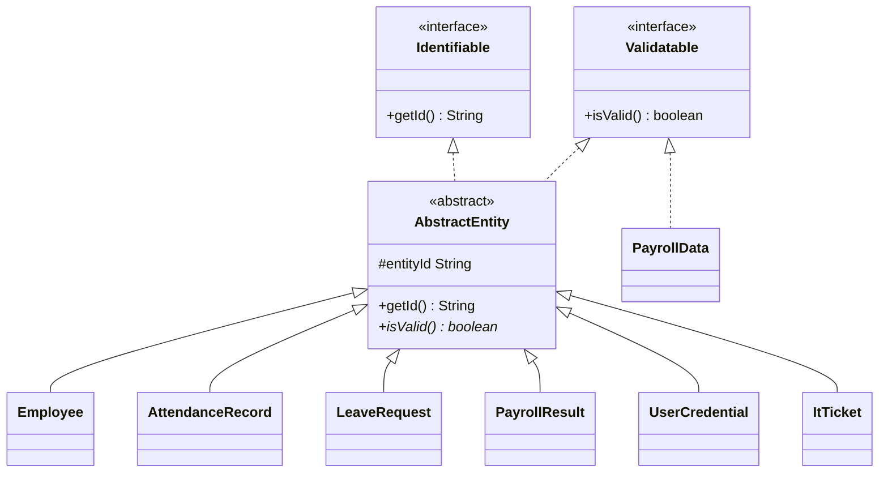
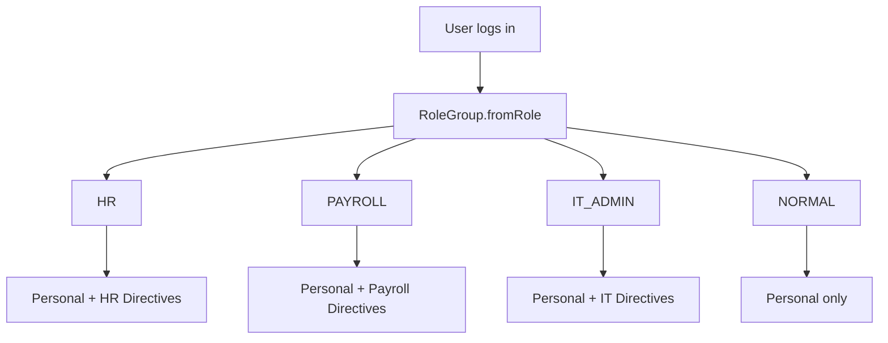
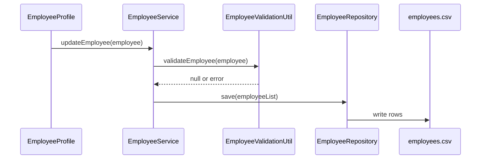
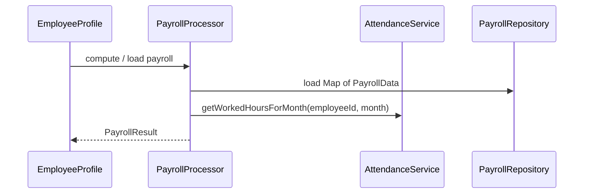

# GEAR.HR — Architectural Overview

GEAR.HR is a **layered desktop application** built with **Java Swing**. It manages employees, attendance, leave, payroll, user credentials, and IT tickets. All persistent data lives in **CSV files** under `csv/`. The UI adapts navigation and permissions by **role group** (`HR`, `Payroll`, `IT/Admin`, or normal employee).

Related documentation: [CRC Cards and Method Dictionary](CRC-and-Method-Dictionary.md).

---

## 1. Architectural style

The codebase follows a **classic three-tier layout** adapted for a single-process desktop app:

| Layer | Package | Responsibility |
|-------|---------|----------------|
| **Presentation** | `ui` | Swing screens, forms, tables, navigation; calls services through `ApplicationContext` |
| **Business / application** | `service` | Use cases, validation orchestration, auth, payroll computation, role mapping |
| **Persistence** | `repository` | Load/save domain data to CSV; no business rules |
| **Domain** | `model` | Entities, value objects, `Identifiable` / `Validatable` contracts |
| **Cross-cutting helpers** | `util` | Stateless validation and payroll math used by model and service layers |

There is **no database** and **no network API**. The composition root [`ApplicationContext`](../src/service/ApplicationContext.java) wires concrete repositories and services once at startup and passes that object into the UI (manual dependency injection).

---

## 2. Layer diagram



**Dependency rule:** `ui` → `service` → `repository` → `model`. `util` is depended on by `model`, `service`, and `ui` but does not depend on them. `repository` does not depend on `service` or `ui`.

---

## 3. Package structure

```
GEAR.HR/
├── csv/                          # Runtime data (6 CSV files)
├── docs/                         # Documentation
├── src/
│   ├── model/          (10 types)  Domain entities + Identifiable, Validatable
│   ├── repository/     (13 types)  I*Repository + CSV repos + AbstractCsvListRepository
│   ├── service/        (17 types)  Services, ApplicationContext, RoleGroup enum
│   ├── ui/             (10 types)  Screens, Main, ModuleScreen, InputFilters
│   └── util/           (4 types)   Validation, payroll formulas, table sorting
└── README.md
```

Entry point: [`Main.main`](../src/ui/Main.java) → splash → login → role-based dashboard.

---

## 4. Component diagram (major types)



`ApplicationContext` is the **only** place that instantiates repositories and services. UI classes receive `ApplicationContext` via `ModuleScreen.show(...)` or login/dashboard helpers.

---

## 5. Application startup and navigation

### Startup sequence



### Opening a module

`Main` opens feature screens through the **`ModuleScreen`** interface (polymorphism). Each module implements `show(parentFrame, userId, role, group, ctx)` and pulls the services it needs from `ctx`.



---

## 6. Persistence architecture

### CSV files

| File | Repository | Domain type |
|------|------------|-------------|
| `csv/employees.csv` | `EmployeeRepository` | `Employee` |
| `csv/attendance_records.csv` | `AttendanceRepository` | `AttendanceRecord` |
| `csv/leave_requests.csv` | `LeaveRequestRepository` | `LeaveRequest` |
| `csv/payroll_records.csv` | `PayrollRepository` | `Map<String, PayrollData>` |
| `csv/user_credentials.csv` | `UserCredentialRepository` | `UserCredential` |
| `csv/ITtickets.csv` | `ItTicketRepository` | `ItTicket` |

### Repository pattern

Most list-based repos extend **`AbstractCsvListRepository<T>`**, which implements:

- `load()` — read file, skip header, parse lines via subclass hooks
- `save(List<T>)` — write header + rows via `toCsvRow`

Subclasses supply: `getFilePath()`, `getHeader()`, `parseLine()`, `toCsvRow()`.

**Exception:** `PayrollRepository` implements `IPayrollRepository` directly and persists a **`Map<String, PayrollData>`** (employee ID → payroll row), not a `List`.



Services typically **load into memory** on use, mutate collections, then **save** back to CSV (e.g. `EmployeeService.loadEmployeesFromCSV` / `saveEmployeesToCSV`).

---

## 7. Domain model



- **`AbstractEntity`** — shared ID and abstract validation; subclasses implement `isValid()`.
- **`PayrollData`** — payroll configuration per employee; implements `Validatable` only (no entity ID in the class itself; keyed by employee ID in the map).
- **`PayrollResult`** — computed payroll snapshot for display/reporting.
- **`AuthContext`** — immutable post-login context (not an entity; lives in `service`).

Format validation for employees and credentials is delegated to **`EmployeeValidationUtil`** and **`CredentialValidationUtil`**.

---

## 8. Service layer (use cases)

| Service | Primary responsibility | Key dependencies |
|---------|------------------------|------------------|
| `AuthenticationService` | Load credentials, authenticate user, resolve `AuthContext` | `EmployeeService` (implicit via employee lookup) |
| `EmployeeService` | CRUD employees, CSV sync, duplicate checks | `IEmployeeRepository`, `IUserCredentialService` |
| `AttendanceService` | Attendance CRUD, monthly hours for payroll | `IAttendanceRepository` |
| `LeaveService` | Leave requests, overlap checks, status updates | `ILeaveRequestRepository` |
| `PayrollProcessor` | Load/save payroll map, compute `PayrollResult` using attendance hours | `IPayrollRepository`, `IAttendanceService` |
| `UserCredentialService` | Admin credential CRUD, sync with new employees | `IUserCredentialRepository`, `IAuthenticationService` |
| `ItTicketService` | IT ticket CRUD | `IItTicketRepository` |
| `PayrollReport` | Format `PayrollResult` as readable text | (static helper, no state) |

**Payroll computation flow:** UI or service requests payroll → `PayrollProcessor` loads `PayrollData` + attendance hours → uses `PayrollData` methods and **`PayrollUtils`** for statutory amounts → returns **`PayrollResult`**.

---

## 9. Role-based access control

Roles are **strings** in `user_credentials.csv`. [`RoleGroup`](../src/service/RoleGroup.java) maps them to four groups:

| Group | Example roles | Extra UI (Directives) |
|-------|---------------|------------------------|
| `HR` | HR Manager, HR Team Leader, HR Rank and File | Attendance Management, Employee Profile, Leave Management |
| `PAYROLL` | Payroll Manager, Account Team Leader, … | Payroll Management, View Attendance, View Leave Requests |
| `IT_ADMIN` | IT, IT Operations and Systems | Attendance, Employee Profile & Payroll, Leave, Credential/IT admin |
| `NORMAL` | Any other role | Personal modules only (attendance, profile, leave) |



Fine-grained rules (e.g. HR can view but not edit payroll) are enforced **inside UI classes** such as `EmployeeProfile` and `AttendanceScreen`, using the `RoleGroup` passed into `show(...)`.

---

## 10. Design patterns and OOP themes

| Pattern / principle | Where it appears |
|---------------------|------------------|
| **Layered architecture** | `ui` / `service` / `repository` / `model` |
| **Repository** | `I*Repository` + CSV implementations |
| **Template method** | `AbstractCsvListRepository.load/save` |
| **Dependency injection (manual)** | `ApplicationContext` composition root |
| **Interface segregation** | `IEmployeeService`, `IAttendanceService`, etc. |
| **Strategy / polymorphism** | `ModuleScreen` — `Main` opens any module uniformly |
| **Abstract base class** | `AbstractEntity`, `BaseModuleScreen` |
| **Factory** | `RoleGroup.fromRole(String)` |
| **DTO / value object** | `PayrollResult`, `AuthContext`, `PayrollData` |
| **Utility / facade** | `InputFilters`, validation utils, `PayrollUtils` |

Coursework Javadoc tags (`[ABSTRACTION]`, `[POLYMORPHISM]`, `[INHERITANCE]`, `[ENCAPSULATION]`, `[INTERFACE]`) mark intentional OOP teaching points throughout the source.

---

## 11. Typical request flows

### Employee update (HR / IT)



### Payroll view (employee)



---

## 12. Boundaries and limitations

- **Single-user desktop:** No concurrent access control on CSV files; last save wins.
- **No formal build tool** in-repo: compile/run from IDE with `src` as source root.
- **Relative paths:** `csv/` and `Logo/` paths assume the working directory is the project root.
- **IT ticket repository:** `ApplicationContext` can fall back to a no-op `IItTicketRepository` if `ItTicketRepository` fails to load via reflection (defensive bootstrap).
- **Testing:** No automated test suite in the repository; behavior is validated manually through the Swing UI.

---

## 13. Extension points

To extend the system without rewriting the UI shell:

1. **New storage** — Implement `I*Repository` interfaces (e.g. JDBC) and swap instances in `ApplicationContext`.
2. **New module** — Implement `ModuleScreen`, register navigation in `Main` for the appropriate `RoleGroup`(s).
3. **New business rule** — Add or extend a `service` class; keep CSV I/O in `repository`.
4. **New entity** — Add `model` class (often extending `AbstractEntity`), repository, service, and optional UI screen.

---

## 14. Quick reference — file to layer

| Source path | Layer |
|-------------|-------|
| `src/ui/*.java` | Presentation |
| `src/service/*.java` | Application / business |
| `src/repository/*.java` | Persistence |
| `src/model/*.java` | Domain |
| `src/util/*.java` | Shared helpers |
| `csv/*.csv` | Data store |
