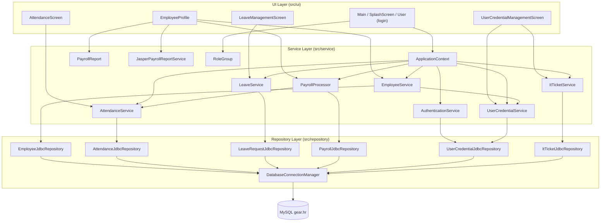
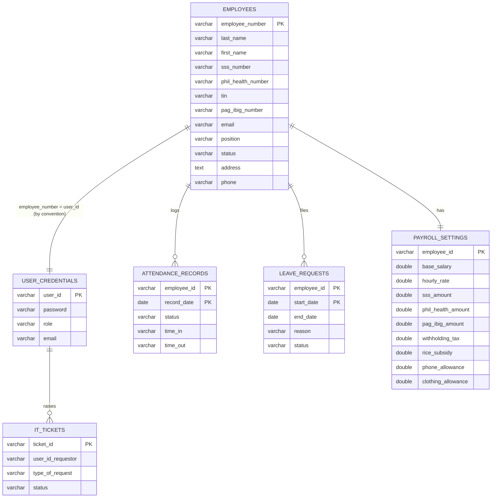
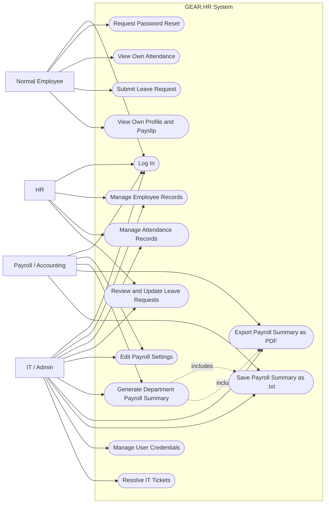
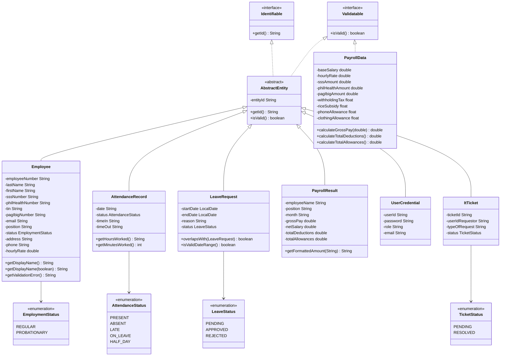

# 

# 

# 

# Expanded MotorPH Payroll System SRS

Prepared and Presented by:

***\<Insert Learner’s Name Here\>***  
***\<Insert Learner Program and Specialization)***  
*\<Term\> \<Academic Year\>*

# **TABLE OF CONTENTS**

[**1\. Introduction	3**](#introduction)

[1.1. Purpose	3](#purpose)

[1.2. Project Scope and Exclusions	3](#project-scope-and-exclusions)

[1.3. Final System Reference	3](#final-system-reference)

[**2\. Overall Description	3**](#overall-description)

[2.1. Product Perspective	3](#product-perspective)

[2.2. User Needs	3](#user-needs)

[2.3. Assumptions and Dependencies	4](#assumptions-and-dependencies)

[**3\. System Features and Requirements	4**](#system-features-and-requirements)

[3.1. System Features	4](#system-features)

[3.2. Non-functional Requirements	4](#non-functional-requirements)

[**4\. Appendix	4**](#appendix)

[4.1. Glossary	4](#glossary)

[4.2. Diagrams	4](#diagrams)

[4.3  Testing Artifacts (Reference Only)	4](#4.3-testing-artifacts-\(reference-only\))

1. # **Introduction** {#introduction}

   1. ## **Purpose** {#purpose}

      * This Software Requirements Specification (SRS) documents the functional and non-functional requirements of **GEAR.HR**, a Java Swing desktop application that implements the expanded MotorPH Payroll System. Rather than describing a system that is still to be built, this SRS describes the system **as it currently exists in the codebase**: a layered application (`ui` → `service` → `repository`) backed by a MySQL database (`gear.hr`) accessed exclusively through JDBC.  
      * The document is organized into four parts: **Section 1** introduces the purpose, scope, exclusions, and repository reference; **Section 2** describes the product from a high-level perspective and the needs of its different user roles; **Section 3** enumerates the concrete system features implemented in the codebase (employee management, attendance, leave, payroll computation, and reporting) together with the non-functional qualities observed in the implementation; and **Section 4** provides a glossary, architecture/data diagrams, and references to the testing artifacts that validate the system.  
      * The key stakeholders who will use this document are: the **development team** (Colin Bactong, Charlize Bactong, Angelica Mae Calipayan, and Chelsie Mae Ricafrante) who built and maintain GEAR.HR; the **mentor/evaluator** assessing the Terminal Assessment submission against the stated requirements; and the **end users** of the system in each role group — HR, Payroll/Accounting, IT/Admin, and normal employees — whose needs the features in Section 2.2 and 3.1 are meant to satisfy.

      

   2. ## **Project Scope and Exclusions** {#project-scope-and-exclusions}

      * **Scope:** GEAR.HR is a single-company, desktop-based HR and payroll management system for MotorPH, built with **Java Swing** for the UI and **MySQL (`gear.hr`)** for storage, connected exclusively through **JDBC** (`src/repository/*JdbcRepository.java`, `src/repository/DatabaseConnectionManager.java`). The system's objective is to replace manual/paper-based HR record-keeping with a single application that lets authorized staff maintain employee records, track daily attendance, process leave requests, configure payroll settings, and generate payroll reports — while giving every employee visibility into their own attendance, leave, and payslip data. Concretely, the implemented product covers:  
        * **Employee record management** — create, update, deactivate, and look up employee profiles (`src/service/EmployeeService.java`, `src/ui/EmployeeProfile.java`).  
        * **Attendance tracking** — daily time-in/time-out entry and status recording (`src/ui/AttendanceScreen.java`, `src/service/AttendanceService.java`).  
        * **Leave request management** — submission, listing, and status updates with overlap checking (`src/ui/LeaveManagementScreen.java`, `src/service/LeaveService.java`).  
        * **Payroll computation** — gross pay from hourly rate and worked hours, and statutory deductions (SSS, PhilHealth, Pag-IBIG, withholding tax) computed by `src/util/PayrollUtils.java` and orchestrated by `src/service/PayrollProcessor.java`.  
        * **Payroll reporting** — individual payslip text, department-level summary text, and PDF export via JasperReports (`src/service/PayrollReport.java`, `src/service/JasperPayrollReportService.java`, `src/reports/payroll_summary.jrxml`).  
        * **Role-based access control** — HR, Payroll/Accounting, IT/Admin, and Normal Employee views driven by `src/service/RoleGroup.java`.  
        * **User credential and IT ticket administration** — password/role management and "Forgot Password" ticketing (`src/ui/UserCredentialManagementScreen.java`, `src/service/UserCredentialService.java`, `src/service/ItTicketService.java`).  
      * **Exclusions:** The following are outside the boundaries of the implemented system:  
        * **Employee performance management** — no performance evaluations, KPIs, or goal-setting features exist in the codebase.  
        * **Biometric or physical time-clock integration** — attendance is entered manually through `AttendanceScreen`; there is no hardware/biometric device integration.  
        * **Statutory e-filing / government portal integration** — SSS, PhilHealth, Pag-IBIG, and BIR amounts are computed locally by `PayrollUtils` for record-keeping only; the system does not submit or file these amounts with any government agency.  
        * **Multi-company, multi-branch, or multi-currency support** — the schema and services assume a single company (`gear.hr`) with one currency (PHP) and no branch/location dimension.  
        * **Web or mobile access** — the application is a single-machine Java Swing desktop client; there is no web server, REST API, or mobile client in the codebase.  
        * **Automated leave-accrual or leave-balance policy engine** — `LeaveRequest` only tracks submitted requests and their `LeaveStatus` (Pending/Approved/Rejected); there is no leave-credit accrual, carry-over, or balance calculation.  
        * **Independent approval safeguards for leave requests** — as noted in mentor feedback (`Documents/Mentor Feedback.md`), the current implementation does not prevent a user with leave-approval access from approving their own leave request; a segregation-of-duties control is not implemented.  
        * **Centralized application logging/auditing** — the codebase does not use a logging framework (no `Logger`/Log4j/SLF4J calls); errors are surfaced only through `JOptionPane` dialogs or silently handled.

   3. ## **Final System Reference** {#final-system-reference}

      * **Final System Repository Link:** *\<insert link to group’s final MotorPH Payroll System repository\>*

      

2. # **Overall Description** {#overall-description}

   1. ## **Product Perspective** {#product-perspective}

* GEAR.HR is a standalone, layered Java Swing desktop application. Its entry point is `src/ui/Main.java`, which constructs a single `service.ApplicationContext` — the composition root that wires every JDBC repository (`src/repository/*JdbcRepository.java`) into its corresponding service (`src/service/*Service.java`), and hands those services to the UI screens. This gives the product a clean **UI → Service → Repository → MySQL** layering: Swing screens never talk to the database directly, and business logic (e.g., payroll math) never lives inside a screen class.  
* **Startup flow (illustrative example):** `Main.main()` creates the `ApplicationContext`, shows `SplashScreen` for a couple of seconds, then opens the `User` login screen. On a successful login, `AuthenticationService` returns an `AuthContext` with the user's role string, `RoleGroup.fromRole(role)` classifies it into `HR`, `PAYROLL`, `IT_ADMIN`, or `NORMAL`, and `Main.showMainScreen(...)` renders a sidebar tailored to that group (see Section 2.2).  
* **Key features at a glance:**  
  * **Employee Profile** (`src/ui/EmployeeProfile.java`) is the central module: for HR/Payroll/IT users it exposes three tabs — **Employee Directory** (CRUD table), **Employee Payroll Data** (view/edit payroll settings), and **Payroll Summary** (pick a department and month, generate a live summary, then save it as `.txt` or export it as a PDF via JasperReports). For normal employees it instead shows **My Profile** (personal info + live salary computation) and **Personal Payroll** (read-only payroll row).  
  * **Attendance** and **Leave** modules (`AttendanceScreen`, `LeaveManagementScreen`) follow the same pattern: the same screen class adapts its available actions (add, delete, clear-all, approve/reject) based on the caller's `RoleGroup`.  
  * **Payroll computation** is centralized in `PayrollProcessor.processPayroll(Employee, month)`, which multiplies the employee's hourly rate by the hours worked that month (from `AttendanceService.getWorkedHoursForMonth`) to get gross pay, then applies the statutory deduction formulas in `PayrollUtils` to produce a `PayrollResult` — the same object consumed by both the on-screen payslip and the exported reports, so numbers never drift between views.  
* This product perspective illustrates that GEAR.HR is self-contained: it has no external system dependency beyond the MySQL server it connects to and the local JasperReports/iText libraries used purely for PDF rendering.

  2. ## **User Needs** {#user-needs}

     * User needs are grouped by the four `RoleGroup` values that the system already recognizes (`src/service/RoleGroup.java`) and are implemented through role-specific sidebars in `Main.createSidebarPanel` and role checks inside each screen.  
     * **Normal Employee** (any role string not matched to HR/Payroll/IT — e.g., regular staff):  
       * Needs to view their own attendance history without seeing other employees' records — met by `AttendanceScreen` filtering to the logged-in `employeeId`.  
       * Needs to file and track leave requests — met by `LeaveManagementScreen`'s submission form and status list.  
       * Needs to see their own salary computation and payslip without needing HR intervention — met by the **My Profile** / **Personal Payroll** tabs in `EmployeeProfile`.  
     * **HR** (`HR Manager`, `HR Team Leader`, `HR Rank and File`):  
       * Needs to maintain accurate employee master data (new hires, status changes, contact info) — met by the **Employee Directory** tab's create/update/delete actions, validated by `EmployeeValidationUtil`.  
       * Needs to manage attendance and leave records for the whole workforce, including correcting or deleting erroneous entries — met by HR-only **Delete**/**Clear** actions in `AttendanceScreen` and status-update/delete actions in `LeaveManagementScreen`.  
       * Needs read-only visibility into payroll data for HR-relevant decisions without being able to alter pay figures — met by `EmployeeProfile` showing payroll data as view-only for HR (no Edit Payroll action).  
     * **Payroll / Accounting** (`Payroll Manager/Team Leader/Rank and File`, `Accounting Head`, `Account Manager/Team Leader/Rank and File` — all mapped to `RoleGroup.PAYROLL`):  
       * Needs to configure and adjust each employee's pay components (hourly rate, allowances, deduction bases) — met by the **Edit Payroll** action available to Payroll on the Employee Payroll Data tab.  
       * Needs to produce department-level payroll summaries for a given month and export them for record-keeping — met by the **Payroll Summary** tab's Generate Summary, Save-to-`.txt`, and Export-PDF (JasperReports) actions.  
       * Needs visibility into attendance and leave data to sanity-check worked hours feeding into payroll, without needing edit rights over those records — met by Payroll's view-only mode in `AttendanceScreen`/`LeaveManagementScreen`.  
     * **IT / Admin** (`IT`, `IT Operations and Systems`):  
       * Needs full administrative reach across employee, attendance, leave, and payroll screens to support other roles and fix data issues — met by IT/Admin being granted the broadest access (edit payroll, delete attendance, manage leave, manage employees) across the same screens.  
       * Needs to manage login credentials and reset forgotten passwords — met by `UserCredentialManagementScreen`, the only screen restricted to IT/Admin, and the "Forgot Password" flow on the login screen that creates an `ItTicket` for IT to resolve.  
     * These needs are prioritized in the order the system currently enforces them: **data integrity and role separation first** (validation utilities, role-gated actions), **day-to-day self-service second** (attendance/leave/payroll self-view), and **reporting third** (department summaries and PDF export). Future refinement (e.g., leave-approval segregation of duties, noted in Section 1.2 Exclusions) is intentionally left open for iterations beyond this Terminal Assessment.

  3. ## **Assumptions and Dependencies** {#assumptions-and-dependencies}

     * **User-centric assumptions:**  
       * Every user already has a valid account in the `user_credentials` table (created either via `sql/seed.sql` sample data or by an IT/Admin user) before they attempt to log in through `User.showLoginScreen`; the system has no public self-registration screen.  
       * Users know and stay within the actions exposed to their `RoleGroup`; the UI hides or omits controls a role should not use (e.g., Payroll sees no Delete/Clear on attendance), but the system does not add a second layer of confirmation beyond what each screen already implements.  
       * Each employee is assumed to use the desktop application from a single workstation at a time — there is no session/concurrency management for two users editing the same record simultaneously.  
       * Users responsible for approving leave requests are trusted to use that access appropriately, since (per Section 1.2 Exclusions) the system does not currently block a user from approving their own submitted leave request.  
       * Role strings entered in `user_credentials.role` are assumed to exactly match one of the strings `RoleGroup.fromRole` recognizes (e.g., `"HR Manager"`, `"IT"`); any unrecognized string is assumed to be intentional and defaults the user to `RoleGroup.NORMAL`.  
     * **Dependencies:**  
       * **MySQL Server 8.x** must be installed and reachable, with the `gear.hr` schema created from `sql/schema.sql` and (optionally) seeded from `sql/seed.sql`; this is the sole persistence mechanism — there is no file-based or in-memory fallback in the shipped application.  
       * **Connection configuration** in `database.properties` (`db.url`, `db.user`, `db.password`) must be present and correct, and is read by `src/repository/DatabaseConnectionManager.java` at runtime.  
       * **MySQL Connector/J JDBC driver** jar under `lib/`, registered on the classpath via `.classpath`, is required for any database call to succeed.  
       * **JasperReports, iText, and Apache Commons jars** under `lib/` are required for the **Export PDF (JasperReports)** feature in `EmployeeProfile`; without them, PDF export (though not the rest of the application) would fail.  
       * **A Java runtime supporting Swing** (JDK 8+) is required to run `src/ui/Main.java`, since the entire UI is built on `javax.swing`.

3. # **System Features and Requirements** {#system-features-and-requirements}

   1. ## **System Features** {#system-features}

* **Authentication and Role-Based Access Control**  
  * Users log in with a `userId` and password on `src/ui/User.java`. `AuthenticationService.authenticate(userId, password)` checks the credential against records loaded through `IUserCredentialRepository` (`UserCredentialJdbcRepository`, table `user_credentials`) and returns an `AuthContext` (`role`, `email`) on success.  
  * `RoleGroup.fromRole(String role)` classifies the authenticated role string into one of **HR**, **PAYROLL**, **IT\_ADMIN**, or **NORMAL**. This classification drives which sidebar items `Main.createSidebarPanel` renders and which actions each screen exposes (see the role tables in Section 2.2 and the project `README.md`).  
  * A "Forgot Password" action on the login screen creates an `ItTicket` (via `ItTicketService`) so IT/Admin can follow up, instead of resetting the password automatically.

* **Employee Directory Management**  
  * `EmployeeService` (backed by `EmployeeJdbcRepository`, table `employees`) supports creating, updating, and deleting employee records, plus uniqueness checks on SSS number, PhilHealth number, TIN, Pag-IBIG number, email, and phone number before a record is saved.  
  * `EmployeeValidationUtil` enforces field formats (5-digit employee number, `##-#######-#` SSS format, 12-digit PhilHealth/Pag-IBIG numbers, `###-###-###-###` TIN, letters-only names/position, valid email, and a status of `regular` or `probationary`).  
  * `src/ui/EmployeeProfile.java`'s **Employee Directory** tab (HR/Payroll/IT/Admin) presents this data in a sortable table (`TableColumnSortUtil`) with New/Update/Delete actions gated to HR and IT/Admin; HR's employee-detail view opens read-only for payroll figures.  
  * Creating an employee automatically provisions a matching login through `IUserCredentialService`, with a default password (`MotorPH123`) that can later be changed via `UserCredentialManagementScreen`.

* **Attendance Management**  
  * `AttendanceRecord` stores an employee ID, date, `AttendanceStatus` (`Present`, `Absent`, `Late`, `On Leave`, `Half Day`), and time-in/time-out strings; `getHoursWorked()`/`getMinutesWorked()` compute the worked duration and reject a time-out earlier than the time-in.  
  * `AttendanceService` (backed by `AttendanceJdbcRepository`, table `attendance_records`) persists records and exposes `getWorkedHoursForMonth(employeeId, monthName)`, which sums valid minutes for a given employee and month — the same figure payroll computation depends on.  
  * `src/ui/AttendanceScreen.java` adapts by role: HR/IT/Admin can delete a selected row or clear all records; Payroll and normal employees have a view-only or self-only experience with no delete/clear-all actions.

* **Leave Request Management**  
  * `LeaveRequest` stores an employee ID, start/end dates, a reason, and a `LeaveStatus` (`Pending`, `Approved`, `Rejected`), and includes overlap-checking logic to flag conflicting date ranges for the same employee.  
  * `LeaveService` (backed by `LeaveRequestJdbcRepository`, table `leave_requests`) persists requests and rejects new submissions that overlap an existing request for the same employee.  
  * `src/ui/LeaveManagementScreen.java` lets normal employees submit and track their own requests, while HR and IT/Admin can update request status (approve/reject) and delete records; Payroll has view-only access for cross-checking leave against payroll.

* **Payroll Settings and Computation**  
  * `PayrollData` holds the configurable pay inputs per employee — base salary, hourly rate, SSS/PhilHealth/Pag-IBIG amounts, withholding tax, and rice/phone/clothing allowances — and `calculateGrossPay(hours)` clamps negative worked hours to zero before multiplying by the hourly rate.  
  * `PayrollProcessor.processPayroll(Employee, month)` is the single computation entry point: it loads the employee's `PayrollData` from `PayrollJdbcRepository` (table `payroll_settings`, defaulting rice/phone/clothing allowances to 1500/1000/800 if unset), asks `AttendanceService` for the employee's worked hours that month, computes gross pay, and applies `PayrollUtils` to derive SSS, PhilHealth, Pag-IBIG, and withholding-tax deductions from the **actual computed gross** (not a stored snapshot) before producing a `PayrollResult` with gross pay, each deduction, each allowance, and net salary.  
  * `PayrollUtils` implements the statutory formulas as static methods: a graduated **SSS** bracket table (₱250 minimum up to ₱1750 for gross ≥ ₱34,750, moving in ₱500-wide, ₱25-step bands); **PhilHealth** at 5% of gross clamped between ₱500 and ₱5,000; **Pag-IBIG** at 2% of gross capped at ₱200; and a TRAIN-law-style **withholding tax** table applied to taxable compensation (gross pay plus rice, phone, and clothing allowances) with brackets at ₱20,833, ₱33,332, ₱66,666, ₱166,666, and ₱666,666.  
  * Editing payroll settings (`EmployeeProfile`'s Edit Payroll action, restricted to IT/Admin and Payroll) persists updated values through `PayrollProcessor`'s save path, which estimates a deduction snapshot using a reference of `PayrollUtils.REFERENCE_PAYROLL_HOURS = 160` hours for display purposes; the live payslip always recomputes from actual attendance.

* **Payroll Reporting**  
  * `PayrollReport.format(PayrollResult)` renders a single employee's payslip (used by the normal-employee "My Profile" salary view and the HR/Payroll/IT employee-detail view), and `PayrollReport.formatSummary(List<PayrollResult>, department, month)` renders a department-level summary with a header, per-employee sections, and aggregated `DEPARTMENT TOTALS` (employee count, total gross, total net).  
  * `EmployeeProfile`'s **Payroll Summary** tab lets HR/Payroll/IT/Admin pick a department (HR, Payroll, IT/Admin, or Normal Employee) and a month; `collectDepartmentResults()` filters employees by `RoleGroup` (derived from their login role) before calling `PayrollProcessor` and `PayrollReport.formatSummary`, so the summary only ever includes employees from the selected department.  
  * The generated summary can be **saved as a `.txt` file** (`PayrollSummary_<Department>_<Month>.txt`) or **exported as a PDF** through `JasperPayrollReportService.exportToPdf(...)`, which fills the `src/reports/payroll_summary.jrxml` template with the same filtered `PayrollResult` list, guaranteeing the text and PDF outputs always agree.

* **User Credential and IT Ticket Management**  
  * `src/ui/UserCredentialManagementScreen.java`, reachable only by IT/Admin, has two tabs: **User Credentials** (view/update user role and password through `UserCredentialService`) and **IT Tickets** (view, update status, or delete tickets through `ItTicketService`, backed by `UserCredentialJdbcRepository` and `ItTicketJdbcRepository` respectively).  
  * `ItTicket` records a ticket ID (auto-generated, e.g., `T0001`), the requesting user ID, a request type (e.g., "Forgot Password"), and a `TicketStatus` (`Pending`, `Resolved`). Any authenticated user can generate a ticket via the login screen's "Forgot Password" link; only IT/Admin can resolve it.

  2. ## **Non-functional Requirements** {#non-functional-requirements}

     * **Usability** — The application uses a consistent visual theme across screens (shared dark header, orange action buttons, cyan-to-blue gradients, and the Garet font family defined in `src/ui/BaseModuleScreen.java`), and restricts keystrokes at entry time through `src/ui/InputFilters.java` (digits-only, digits-with-hyphen, letters-only filters) so users get immediate feedback before form-level validation runs.  
     * **Reliability** — List-based repositories (`AbstractJdbcRepository.replaceAll`) persist changes using a delete-all-then-batch-insert pattern inside a single JDBC transaction, so a save either fully succeeds or is rolled back rather than leaving partial data. `SQLException`s are caught at the repository boundary and surfaced as empty results or dialog messages rather than crashing the application.  
     * **Security** — Access to each screen and action is gated by `RoleGroup`, computed once at login and checked consistently by the UI layer (e.g., only IT/Admin can open `UserCredentialManagementScreen`; only IT/Admin and Payroll can edit payroll settings). As an as-built limitation, credential passwords are stored and displayed in **plain text** in the `user_credentials` table and in the User Credential Management screen, and authentication is a direct string comparison with no hashing — this is a known gap rather than an implemented control.  
     * **Maintainability** — Every service and repository is defined behind an interface (`IEmployeeService`/`EmployeeService`, `IEmployeeRepository`/`EmployeeJdbcRepository`, etc.), and `ApplicationContext` is the only class that instantiates concrete implementations. This lets a repository or service implementation be replaced without changing UI or calling code, and keeps payroll, attendance, and validation logic centralized in single classes (`PayrollUtils`, `PayrollProcessor`, `EmployeeValidationUtil`) rather than duplicated across screens.  
     * **Portability** — The system depends only on a standard JDK with Swing and a MySQL server reachable via JDBC; there is no operating-system-specific code, and the README documents both an IDE-based and a manual `javac`/`java` classpath-based build, so the application can run on any platform with a compatible JVM and JDBC driver.  
     * **Testability** — Business logic that does not require a live database is covered by a JUnit 4 suite under `test/` (`PayrollUtilsTest`, `PayrollProcessorTest`, `PayrollReportTest`, `RoleGroupTest`, `StatusEnumTest` — 20 tests, all passing per `Documents/Implementation Plan and Test Cases/Unit Test Planning and Coverage Summary.md`) using in-memory fake repositories, so payroll math, report formatting, and role mapping can be verified without a running MySQL instance. Fixed-state values are modeled as enums (`EmploymentStatus`, `LeaveStatus`, `AttendanceStatus`, `TicketStatus`) with `fromString()` parsing at the persistence boundary, reducing the chance of invalid status strings reaching business logic.  
     * **Auditability/Logging** — As an as-built limitation, the codebase does not integrate a logging framework; there is no persistent audit trail of who changed what record and when, beyond the data itself (e.g., the current value stored in `payroll_settings` or `employees`).

4. # **Appendix** {#appendix}

   1. ## **Glossary** {#glossary}

      | Term | Definition |
      | ----- | ----- |
      | **ApplicationContext** | The composition root class (`src/service/ApplicationContext.java`) that constructs all JDBC repositories and services once at startup and exposes them to the UI. |
      | **AttendanceRecord** | Model class representing one employee's attendance for one date, including status and time-in/time-out. |
      | **AttendanceStatus** | Enum of daily attendance states: `Present`, `Absent`, `Late`, `On Leave`, `Half Day`. |
      | **AbstractJdbcRepository** | Base class supplying the shared "delete all, then batch insert" persistence pattern used by most JDBC repositories. |
      | **EmploymentStatus** | Enum of an employee's employment classification: `regular` or `probationary`. |
      | **GEAR.HR** | The project name for this MotorPH Payroll System implementation; also the name of the MySQL database (`gear.hr`). |
      | **ItTicket** | Model representing an IT support request (e.g., a "Forgot Password" ticket) with a `TicketStatus`. |
      | **JasperReports** | Third-party Java reporting library used to fill `src/reports/payroll_summary.jrxml` and export payroll summaries as PDF files. |
      | **JDBC (Java Database Connectivity)** | The Java API used by all repository classes in `src/repository/` to communicate with the MySQL `gear.hr` database. |
      | **LeaveRequest** | Model representing an employee's request for leave, with a date range, reason, and `LeaveStatus`. |
      | **LeaveStatus** | Enum of leave-approval states: `Pending`, `Approved`, `Rejected`. |
      | **Pag-IBIG** | Home Development Mutual Fund; a mandatory Philippine government contribution computed by `PayrollUtils.calculatePagIbigAmount`. |
      | **PayrollData** | Model holding the configurable payroll inputs for an employee (base salary, hourly rate, deduction and allowance amounts) persisted in `payroll_settings`. |
      | **PayrollProcessor** | Service class that computes a complete payroll result for an employee and month by combining `PayrollData`, worked hours, and `PayrollUtils` formulas. |
      | **PayrollResult** | Model/DTO holding the fully computed output of a payroll run (gross pay, each deduction, each allowance, net salary) for reporting. |
      | **PayrollUtils** | Utility class implementing the SSS, PhilHealth, Pag-IBIG, and withholding-tax calculation formulas as static methods. |
      | **PhilHealth** | Philippine Health Insurance Corporation; a mandatory health-insurance contribution computed by `PayrollUtils.calculatePhilHealthAmount`. |
      | **RoleGroup** | Enum/classification (`HR`, `PAYROLL`, `IT_ADMIN`, `NORMAL`) that groups many individual role strings into one of four access levels. |
      | **SRS** | Software Requirements Specification — this document. |
      | **SSS** | Social Security System; a mandatory Philippine government contribution computed by `PayrollUtils.calculateSSSAmount` using a graduated bracket table. |
      | **TicketStatus** | Enum of IT ticket states: `Pending`, `Resolved`. |
      | **TIN** | Tax Identification Number; a required identifier field on the `Employee` model. |
      | **UserCredential** | Model representing a login account (`userId`, `password`, `role`, `email`) stored in `user_credentials`. |
      | **Withholding Tax** | Income tax withheld from an employee's pay, computed by `PayrollUtils.calculateWithholdingTax` using graduated tax brackets over taxable compensation. |

   2. ## **Diagrams** {#diagrams}

* **Layered architecture (as implemented):**

* **Entity-relationship diagram (derived from `sql/schema.sql`):**

* Note: `sql/schema.sql` does not declare foreign-key constraints; the relationships above are enforced logically at the application layer (matching `employee_id`/`user_id` values in `EmployeeService`, `AttendanceService`, `LeaveService`, `PayrollProcessor`, and `ItTicketService`) rather than by the database engine.

* **Use case diagram:**

* This diagram covers the use cases implemented across `src/ui/User.java` (login, forgot password), `src/ui/AttendanceScreen.java`, `src/ui/LeaveManagementScreen.java`, `src/ui/EmployeeProfile.java` (employee records, payroll settings, payroll summary), and `src/ui/UserCredentialManagementScreen.java` (credentials and IT tickets), consistent with the role-based access described in Section 2.2.

* **UML class diagram — domain model** (`src/model/`):

* `PayrollData` intentionally does **not** extend `AbstractEntity` (it has no single-field identity of its own — it is keyed by employee ID at the repository/map level), but it still implements `Validatable`, matching `src/model/PayrollData.java`.

* **UML class diagram — persistence layer** (`src/repository/`):

```mermaid
classDiagram
    class IEmployeeRepository {
        <<interface>>
        +load() List~Employee~
        +save(List~Employee~) void
    }
    class IAttendanceRepository {
        <<interface>>
        +load() List~AttendanceRecord~
        +save(List~AttendanceRecord~) void
    }
    class ILeaveRequestRepository {
        <<interface>>
        +load() List~LeaveRequest~
        +save(List~LeaveRequest~) void
    }
    class IPayrollRepository {
        <<interface>>
        +load() Map~String,PayrollData~
        +save(Map~String,PayrollData~) void
    }
    class IUserCredentialRepository {
        <<interface>>
        +load() List~UserCredential~
        +save(List~UserCredential~) void
    }
    class IItTicketRepository {
        <<interface>>
        +load() List~ItTicket~
        +save(List~ItTicket~) void
    }

    class AbstractJdbcRepository {
        <<abstract>>
        #getTableName() String
        #getInsertSql() String
        #mapRow(ResultSet) T
        #bindInsert(PreparedStatement, T) void
        +loadAll() List~T~
        +replaceAll(List~T~) void
    }

    class EmployeeJdbcRepository
    class AttendanceJdbcRepository
    class LeaveRequestJdbcRepository
    class UserCredentialJdbcRepository
    class ItTicketJdbcRepository
    class PayrollJdbcRepository {
        +load() Map~String,PayrollData~
        +save(Map~String,PayrollData~) void
    }

    class DatabaseConnectionManager {
        <<utility>>
        +getConnection() Connection
        +closeConnection(Connection) void
    }

    IEmployeeRepository <|.. EmployeeJdbcRepository
    IAttendanceRepository <|.. AttendanceJdbcRepository
    ILeaveRequestRepository <|.. LeaveRequestJdbcRepository
    IUserCredentialRepository <|.. UserCredentialJdbcRepository
    IItTicketRepository <|.. ItTicketJdbcRepository
    IPayrollRepository <|.. PayrollJdbcRepository

    AbstractJdbcRepository <|-- EmployeeJdbcRepository
    AbstractJdbcRepository <|-- AttendanceJdbcRepository
    AbstractJdbcRepository <|-- LeaveRequestJdbcRepository
    AbstractJdbcRepository <|-- UserCredentialJdbcRepository
    AbstractJdbcRepository <|-- ItTicketJdbcRepository

    EmployeeJdbcRepository ..> DatabaseConnectionManager : uses
    AttendanceJdbcRepository ..> DatabaseConnectionManager : uses
    LeaveRequestJdbcRepository ..> DatabaseConnectionManager : uses
    UserCredentialJdbcRepository ..> DatabaseConnectionManager : uses
    ItTicketJdbcRepository ..> DatabaseConnectionManager : uses
    PayrollJdbcRepository ..> DatabaseConnectionManager : uses
```

* `PayrollJdbcRepository` is map-based (`employeeId → PayrollData`) and therefore does **not** extend `AbstractJdbcRepository<T>` like the five list-based repositories do; it implements the same delete-all-then-insert persistence pattern directly, per `src/repository/PayrollJdbcRepository.java`.

* **UML class diagram — application (service) and presentation (UI) layers:**

```mermaid
classDiagram
    class ApplicationContext {
        +getAuthenticationService() IAuthenticationService
        +getEmployeeService() IEmployeeService
        +getAttendanceService() IAttendanceService
        +getPayrollProcessor() PayrollProcessor
        +getLeaveService() ILeaveService
        +getUserCredentialService() IUserCredentialService
        +getItTicketService() IItTicketService
    }

    class IAuthenticationService {
        <<interface>>
        +authenticate(String, String) Employee
        +getAuthContext(String) AuthContext
        +hasUser(String) boolean
    }
    class IEmployeeService {
        <<interface>>
        +getAllEmployees() List~Employee~
        +addEmployee(Employee) String
        +updateEmployee(Employee) String
        +deleteEmployee(String) void
    }
    class IAttendanceService {
        <<interface>>
        +getAllRecords() List~AttendanceRecord~
        +addRecord(AttendanceRecord) void
        +getWorkedHoursForMonth(String, String) double
    }
    class ILeaveService {
        <<interface>>
        +getAllLeaveRequests() List~LeaveRequest~
        +addLeaveRequest(LeaveRequest) void
        +updateLeaveRequestStatus(String, LocalDate, String) void
    }
    class IUserCredentialService {
        <<interface>>
    }
    class IItTicketService {
        <<interface>>
    }
    class PayrollProcessor {
        +processPayroll(Employee, String) PayrollResult
        +getPayrollData(String) PayrollData
        +updatePayrollData(String, PayrollData) void
    }
    class PayrollReport {
        +format(PayrollResult) String
        +formatSummary(List~PayrollResult~, String, String) String
    }
    class JasperPayrollReportService {
        +exportToPdf(List~PayrollResult~, String, String, String) void
    }
    class RoleGroup {
        <<enumeration>>
        HR
        PAYROLL
        IT_ADMIN
        NORMAL
        +fromRole(String) RoleGroup
    }
    class AuthContext {
        -role String
        -email String
    }

    ApplicationContext --> IAuthenticationService
    ApplicationContext --> IEmployeeService
    ApplicationContext --> IAttendanceService
    ApplicationContext --> ILeaveService
    ApplicationContext --> IUserCredentialService
    ApplicationContext --> IItTicketService
    ApplicationContext --> PayrollProcessor
    IAuthenticationService --> AuthContext
    PayrollProcessor --> IAttendanceService

    class ModuleScreen {
        <<interface>>
        +show(JFrame, String, String, RoleGroup, ApplicationContext) void
    }
    class BaseModuleScreen {
        <<abstract>>
        #createFrame(JFrame, String, int, int) JFrame
        #createHeaderPanel(String, String) JPanel
        #createFooterPanel(String) JPanel
    }
    class Main
    class SplashScreen
    class User
    class EmployeeProfile
    class AttendanceScreen
    class LeaveManagementScreen
    class UserCredentialManagementScreen

    BaseModuleScreen <|-- EmployeeProfile
    BaseModuleScreen <|-- AttendanceScreen
    BaseModuleScreen <|-- LeaveManagementScreen
    BaseModuleScreen <|-- UserCredentialManagementScreen
    ModuleScreen <|.. EmployeeProfile
    ModuleScreen <|.. AttendanceScreen
    ModuleScreen <|.. LeaveManagementScreen
    ModuleScreen <|.. UserCredentialManagementScreen

    Main --> ApplicationContext : creates
    Main --> SplashScreen : shows
    Main --> User : shows
    Main --> RoleGroup : uses
    Main ..> ModuleScreen : opens via show

    User --> IAuthenticationService
    User --> IItTicketService
    EmployeeProfile --> IEmployeeService
    EmployeeProfile --> PayrollProcessor
    EmployeeProfile --> PayrollReport
    EmployeeProfile --> JasperPayrollReportService
    AttendanceScreen --> IAttendanceService
    LeaveManagementScreen --> ILeaveService
    UserCredentialManagementScreen --> IUserCredentialService
    UserCredentialManagementScreen --> IItTicketService
```

* This diagram shows that `Main`, `SplashScreen`, and `User` (login) are plain classes that only *use* `ApplicationContext` and `RoleGroup`, while the four management screens (`EmployeeProfile`, `AttendanceScreen`, `LeaveManagementScreen`, `UserCredentialManagementScreen`) both extend `BaseModuleScreen` (shared look-and-feel) and implement `ModuleScreen` (the polymorphic `show(...)` contract `Main` calls), matching `src/ui/*.java`.

* **Role-based access control diagram:**

```mermaid
flowchart TD
    userCredentials[("user_credentials.role")]
    fromRole["RoleGroup.fromRole(role)"]

    userCredentials --> fromRole

    fromRole --> groupHR["RoleGroup.HR"]
    fromRole --> groupPayroll["RoleGroup.PAYROLL"]
    fromRole --> groupItAdmin["RoleGroup.IT_ADMIN"]
    fromRole --> groupNormal["RoleGroup.NORMAL"]

    rolesHR["HR Manager, HR Team Leader, HR Rank and File"] --> groupHR
    rolesPayroll["Payroll Manager/Team Leader/Rank and File, Accounting Head, Account Manager/Team Leader/Rank and File"] --> groupPayroll
    rolesIt["IT, IT Operations and Systems"] --> groupItAdmin
    rolesNormal["Any other role string"] --> groupNormal

    groupHR --> accessEmployeeRW["Employee Directory: create/update/delete"]
    groupHR --> accessPayrollRO["Payroll Data: view only"]
    groupHR --> accessAttendanceRW["Attendance: delete selected / clear all"]
    groupHR --> accessLeaveRW["Leave Requests: approve/reject/delete"]

    groupPayroll --> accessPayrollRW["Payroll Data: view/edit"]
    groupPayroll --> accessSummary["Payroll Summary: generate, save .txt, export PDF"]
    groupPayroll --> accessAttendanceRO["Attendance: view only"]
    groupPayroll --> accessLeaveRO["Leave Requests: view only"]

    groupItAdmin --> accessEmployeeRW
    groupItAdmin --> accessPayrollRW
    groupItAdmin --> accessSummary
    groupItAdmin --> accessAttendanceRW
    groupItAdmin --> accessLeaveRW
    groupItAdmin --> accessCredentials["User Credential Management screen"]
    groupItAdmin --> accessTickets["IT Ticket Management"]

    groupNormal --> accessOwnAttendance["My Attendance: self records only"]
    groupNormal --> accessOwnLeave["My Leave: submit/track own requests"]
    groupNormal --> accessOwnPayroll["My Profile and Personal Payroll: read-only, self only"]
```

* This diagram traces the access-control path implemented by `src/service/RoleGroup.java` (role string → `RoleGroup`) through to the concrete screen permissions enforced in `src/ui/EmployeeProfile.java`, `src/ui/AttendanceScreen.java`, `src/ui/LeaveManagementScreen.java`, and `src/ui/UserCredentialManagementScreen.java`, and mirrors the role tables already documented in the project `README.md`.

## **4.3 	Testing Artifacts (Reference Only)** {#4.3-testing-artifacts-(reference-only)}

* *The following document provides supporting evidence for system validation and testing.*  
* *This document must be completed and included, as it contains both **QA testing results** and the **Team Contributions Table for the Terminal Assessment**:*  
  * QA Test Planning and Results Summary: [Unit Test Planning and Coverage Summary.md](Implementation%20Plan%20and%20Test%20Cases/Unit%20Test%20Planning%20and%20Coverage%20Summary.md) — documents 41 planned test cases, the 20 implemented and passing JUnit 4 tests under `test/` (`PayrollUtilsTest`, `PayrollProcessorTest`, `PayrollReportTest`, `RoleGroupTest`, `StatusEnumTest`), and known limitations (GUI behavior, full authentication flow, and JDBC/JasperReports integration tests documented as planned but not yet automated).  
  * Related implementation history: [Group Implementation Log (Week 5).md](Implementation%20Plan%20and%20Test%20Cases/Group%20Implementation%20Log%20%28Week%205%29.md), [Group Implementation Log (Week 6-7).md](Implementation%20Plan%20and%20Test%20Cases/Group%20Implementation%20Log%20%28Week%206-7%29.md), and [Group Implementation Log (Week 8).md](Implementation%20Plan%20and%20Test%20Cases/Group%20Implementation%20Log%20%28Week%208%29.md) trace the migration from CSV to JDBC-only persistence and the department-scoped payroll reporting described in Sections 2 and 3 above.

# 