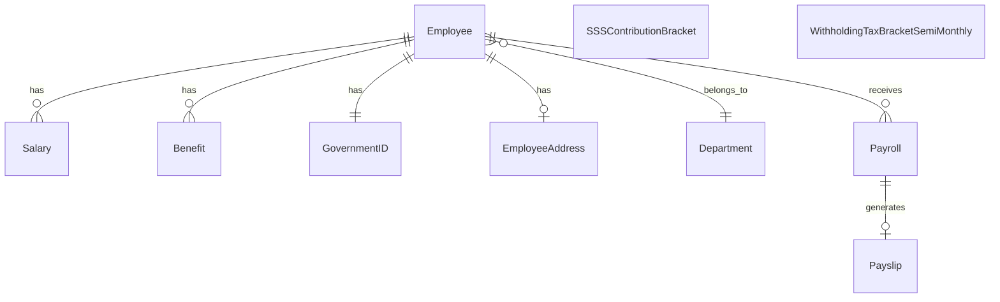
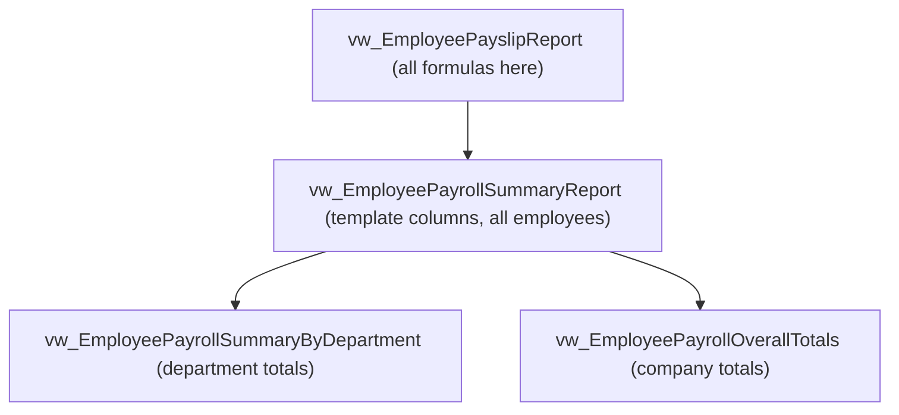

# Milestone 2 — Slide Guide and Speaker Script

Use this as a complete slide-by-slide guide for your Week 10 presentation.

**Target duration:** 8-10 minutes + Q&A  
**Presenter role:** Database Analyst (DA)

---

## Slide 1 — Title and Milestone Context

### Slide content
- Project title: `MotorPH Payroll System - Milestone 2`
- Team name and members
- Milestone focus: database reports and management reporting
- One-line objective: convert normalized payroll data into decision-ready reports

### Speaker script
"Good day. This is our Milestone 2 presentation for the MotorPH Payroll System.  
In this milestone, we focused on SQL-generated reports built from our normalized database in Milestone 1.  
Our goal is to demonstrate two report layers: employee-level payslips and management-level payroll summaries."

---

## Slide 2 — High-Level Overview of Database Reports

### Slide content
- **Employee Payslip Report** (`vw_EmployeePayslipReport`)
  - Columns match the **official MotorPH payslip template**
  - Two payslips for the month (Jun 1–15 and Jun 16–30)
  - Gross Income = Daily Rate × Days Worked; Take Home = Gross + Benefits − Deductions
  - Statutory deductions split (/2) on each cutoff
- **Payroll Summary Report** (`vw_EmployeePayrollSummaryReport`)
  - Monthly rollup of both cutoffs (1 row per employee)
  - Official summary template column names
- **Management Aggregates**
  - `vw_EmployeePayrollSummaryByDepartment`
  - `vw_EmployeePayrollOverallTotals`

### Speaker script
"We implemented two core report categories.  
The payslip report follows the **official MotorPH payslip template** — including Gross Income, Benefits, Deductions, and Take Home Pay.  
Each employee receives **two payslips for the month**, with statutory deductions split on each cutoff.  
The payroll summary then rolls both cutoffs into a monthly view for management review."

---

## Slide 3 — Types of Information Included in Reports

### Slide content
- **Payslip details**
  - Employee profile: ID, name, position, department, government IDs
  - Earnings: basic pay, allowances, gross pay
  - Deductions: SSS, PhilHealth, Pag-IBIG, withholding tax
  - Result: net pay, pay period, issue date
- **Summary details**
  - `Employee No`, `Employee Full Name`, `Position`, `Department`
  - `Gross Income`, statutory contribution fields, `Withholding Tax`, `Net Pay`
- **Management totals**
  - Total employees per department
  - Total gross pay per department
  - Total net pay per department
  - Overall payroll totals

### Speaker script
"The payslip report includes full payroll composition: identity, earnings, deductions, and final net pay.  
The summary report follows the official payroll summary template naming, so output can be reviewed directly by management.  
We also generated management-level totals by department and overall totals for budgeting and payroll control."

---

## Slide 4 — Database Tables Used and Relationships

### Slide content

- Core master data: `Employee`, `Department`, `Salary`, `Benefit`, `GovernmentID`
- Transactional/date data: `Payroll`, `Payslip`
- Statutory lookup/reference: `SSSContributionBracket`, `WithholdingTaxBracketSemiMonthly`

### Speaker script
"Our reports are built on normalized relationships from the payroll schema.  
Employee connects to salary, benefits, and government IDs. Payroll and payslip provide period and issuance metadata.  
Statutory brackets are maintained as lookup tables, which keeps tax and contribution logic modular and maintainable."

---

## Slide 5 — Report Generation Process (SQL Techniques)

### Slide content
- Script flow:
  1. `11_schema_semi_monthly_tax.sql`
  2. `12_seed_payslip_pay_period.sql`
  3. `employee_payslip_report.sql`
  4. `employees_payroll_summary_report.sql`
  5. `14_m2_report_procedures.sql`
- SQL techniques demonstrated:
  - `VIEW` for reusable report layers
  - `JOIN` for cross-table integration
  - `CTE` for readable stepwise calculations
  - Subqueries for bracket lookup
  - `SUM`, `COUNT`, `GROUP BY` for management totals
  - `ROUND`, `COALESCE`, `LEAST`, `GREATEST` operators

### Speaker script
"The report generation is modular and sequential.  
We first prepared semi-monthly tax references and pay period metadata, then built the payslip view, then summary and aggregate views, and finally stored procedures for report consumption.  
The SQL implementation uses joins, CTEs, subqueries, operators, and layered views to maintain consistency and avoid duplicated formulas."

---

## Slide 6 — Management Payroll Summary Enhancement

### Slide content
- Added dedicated management views:
  - `vw_EmployeePayrollSummaryByDepartment`
  - `vw_EmployeePayrollOverallTotals`
- Department report fields:
  - `Department`
  - `Total Employees`
  - `Total Gross Pay`
  - `Total Net Pay`
- Overall report fields:
  - `Total Employees`
  - `Overall Gross Pay`
  - `Overall Net Pay`

### Speaker script
"Based on feedback, we enhanced summary reporting beyond employee-level display.  
We introduced management-ready aggregate views with department and overall payroll totals.  
This directly supports headcount tracking, payroll cost monitoring, and high-level financial review."

---

## Slide 7 — Validation and Testing Results

### Slide content
- Validation queries used:
  - `CALL sp_GetEmployeePayslip(10013)`
  - `CALL sp_GetEmployeePayrollSummary()`
  - `CALL sp_GetPayrollSummaryByDepartment()`
  - `CALL sp_GetPayrollGrandTotals()`
- Consistency checks:
  - Payslip vs summary row counts
  - Payslip vs summary total net pay
  - Expected vs actual values for sample employee
- Evidence:
  - Query outputs
  - `SHOW CREATE VIEW` / `SHOW CREATE PROCEDURE`
  - Successful execution screenshots

### Speaker script
"We validated both detail and aggregate outputs using direct queries and stored procedures.  
We also performed consistency checks between payslip and summary layers to confirm that totals align.  
Our screenshots and SQL object definitions provide execution proof and reproducibility."

---

## Slide 8 — Project Timeline Update (Gantt)

### Slide content
- **Phase 1: Database Design (MS1)** — completed on schedule
- **Phase 2: Database Refinement** — completed with validation and constraint testing
- **Phase 3: Report Development (Weeks 8-9)** — completed
  - Payslip view
  - Summary and management aggregate views
  - Stored procedures
- **Adjustment made:** expanded summary scope to include management-level aggregates and template-aligned columns after feedback
- **Current status:** Milestone 2 deliverables ready for demo and evaluation

### Speaker script
"For the timeline update, database design and refinement phases were completed first.  
During report development, we made an important scope adjustment after feedback: we enhanced summary reporting with management aggregates and aligned columns to the official template.  
This adjustment improved report quality without changing core payslip calculations, so we remained aligned with milestone objectives."

---

## Slide 9 — Conclusion and Q&A

### Slide content
- Deliverables completed:
  - Payslip view
  - Template-aligned summary view
  - Department and overall management summary views
  - Stored procedures for report access
- Key value:
  - Maintainable SQL architecture
  - Accurate payroll reporting
  - Better management decision support

### Speaker script
"To conclude, Milestone 2 demonstrates that our normalized payroll database can produce both detailed employee reports and management-level summaries.  
Our layered SQL design improves maintainability and reporting consistency, while aggregates improve decision-making visibility.  
Thank you, and we are ready for questions."

---

## Suggested slide deck checklist

- [ ] 9 slides prepared in the order above
- [ ] 1 screenshot each: payslip, summary, department totals, overall totals
- [ ] SQL snippets readable (font size and contrast)
- [ ] Presenter script notes copied into slide notes section
- [ ] Dry run timed to 8-10 minutes

---

# Appendix — Payslip and Payroll Summary Reporting (Detailed Explanation)

Use this appendix as backup notes for deeper Q&A, or to expand Slides 2 and 3. It explains **what each report is for**, **who uses it**, **what decisions it supports**, and **how the two reports relate**.

## A. What each report is, in plain terms

### Employee Payslip Report (`vw_EmployeePayslipReport`)

The payslip is a **detailed, per-employee, per-cutoff document**. It answers a single question: *"For this one employee, in this pay period, exactly how was their pay computed?"*

It is a **transactional / operational report** — one row shows one employee's full pay breakdown from gross income down to net pay. Every peso is traceable: earnings are listed, each statutory deduction is shown separately, and the final take-home pay is the last line.

- **Granularity:** one employee, one pay period (most detailed level)
- **Primary use:** issuing official pay documents; letting an employee verify their own pay
- **Nature:** detail-level, evidence-focused, legally required document

### Payroll Summary Report (`vw_EmployeePayrollSummaryReport`)

The payroll summary is a **consolidated, all-employees report** for the same pay period. It answers: *"Across the whole company, what does payroll look like this period?"*

Each row is still one employee, but the columns are trimmed to the **official payroll summary template** fields (identity, gross income, statutory contributions, withholding tax, net pay). It is designed to be read as a **single table for the entire workforce**, so finance can scan every employee at once and reconcile the payroll run.

- **Granularity:** all employees, one pay period (mid-level)
- **Primary use:** payroll run verification, finance reconciliation, audit
- **Nature:** review-level, comparison-focused, batch document

## B. Side-by-side comparison

| Aspect | Employee Payslip | Payroll Summary |
|--------|------------------|-----------------|
| Scope | One employee | All employees |
| Rows | 1 (the selected employee) | Many (whole workforce) |
| Detail level | Highest (every line item) | Condensed to template columns |
| Main audience | Employee, HR/payroll officer | Finance manager, auditor, management |
| Question answered | "How was *my* pay computed?" | "Is the *whole* payroll run correct?" |
| Typical action | Release/verify one payslip | Approve/reconcile the payroll batch |
| SQL object | `vw_EmployeePayslipReport` | `vw_EmployeePayrollSummaryReport` |

## C. Why this layering matters for reporting

The two reports are **not separate calculations** — the summary is built **on top of** the payslip view. All formulas (gross pay, statutory deductions, tax, net pay) live **once** in `vw_EmployeePayslipReport`. The summary and management views only **reshape** or **aggregate** that same data.

Reporting benefit: because there is **one source of truth**, a payslip and the summary can **never disagree**. If an employee's net pay is X on the payslip, the same X appears in the summary and is included in the department and company totals. This is the core reason the design is trustworthy for management reporting.

## D. How reporting flows from detail to decision

1. **Payslip (detail):** confirms accuracy for one employee — the audit-level truth.
2. **Summary (workforce):** lets finance scan and reconcile every employee for the period.
3. **Department totals:** show payroll cost and headcount per department for budget control.
4. **Overall totals:** give a single company-wide payroll figure for cash-flow and approval.

Each level answers a **wider** question than the one before it, but all levels trace back to the same payslip computation.

## E. Speaker talking points (if asked to elaborate)

- "The payslip is our **detail report** — it is what an employee receives and what an auditor traces line by line."
- "The payroll summary is our **management report** — same numbers, but consolidated for the whole company using the official template column names."
- "We deliberately built the summary **from** the payslip view, so the two can never produce conflicting totals."
- "From that single source we roll up to **department totals** and **overall totals**, which is what management actually uses to make budgeting and approval decisions."

---

# Appendix — Purpose of Each SQL Script (Speaker Script)

Read this when walking the panel through **how the five scripts work together to reach the goal**: turning normalized payroll data into accurate payslip and management summary reports. Run them in this exact order.

## The goal in one sentence

"Our goal is to generate an accurate per-employee payslip and a management-level payroll summary from our normalized database — and these five scripts build that result step by step, each one preparing what the next one needs."

## Script 1 — `11_schema_semi_monthly_tax.sql`

**Purpose:** Create and seed the semi-monthly withholding tax reference table (`WithholdingTaxBracketSemiMonthly`).

**Speaker script:**
"The first script prepares our **tax reference data**. MotorPH's official tax table is monthly, but our payroll runs semi-monthly, so we created a dedicated tax bracket table converted to semi-monthly values. This keeps tax rules in their own lookup table instead of hard-coding them, so the payslip computation can simply look up the correct bracket. Without this script, the payslip cannot compute withholding tax."

**Why it comes first:** it is reference data the payslip view depends on.

## Script 2 — `12_seed_payslip_pay_period.sql`

**Purpose:** Provide pay period and issuance metadata by seeding `Payroll` and `Payslip` records (period start, period end, issue date).

**Speaker script:**
"The second script sets up the **pay period context**. A payslip must show which period it covers and when it was issued. This script populates the payroll and payslip records with the period start, end, and issue date. It safely clears any previous run for the same period first, so it can be re-run without creating duplicates. This gives the report its time frame."

**Why it comes second:** it supplies dates the payslip view joins to.

## Script 3 — `employee_payslip_report.sql`

**Purpose:** Create the core calculation view `vw_EmployeePayslipReport` — the single source of truth for all payroll formulas.

**Speaker script:**
"The third script is the **heart of the system**. It creates the payslip view, which joins employee, salary, benefit, government ID, department, payroll, and payslip data, then computes gross pay, each statutory deduction, taxable income, withholding tax, and finally net pay. Every payroll formula lives here and only here. This is the detail report for a single employee, and it becomes the foundation every other report builds on."

**Why it comes third:** it needs the tax table (Script 1) and pay period data (Script 2) to exist.

## Script 4 — `employees_payroll_summary_report.sql`

**Purpose:** Create the template-aligned summary view plus the two management aggregate views (`vw_EmployeePayrollSummaryReport`, `vw_EmployeePayrollSummaryByDepartment`, `vw_EmployeePayrollOverallTotals`).

**Speaker script:**
"The fourth script turns detail into **management reporting**. It builds the payroll summary view directly on top of the payslip view, renaming columns to match the official payroll summary template. It then adds two aggregate views: one for department totals — employees, gross pay, and net pay per department — and one for overall company totals. Because these read from the payslip view, the summary can never disagree with the payslips."

**Why it comes fourth:** it selects from the payslip view created in Script 3.

## Script 5 — `14_m2_report_procedures.sql`

**Purpose:** Create stored procedures that provide a clean, reusable interface to the reports (`sp_GetEmployeePayslip`, `sp_GetEmployeePayrollSummary`, `sp_GetPayrollSummaryByDepartment`, `sp_GetPayrollGrandTotals`).

**Speaker script:**
"The fifth script adds the **access layer**. Instead of writing long queries every time, users call a stored procedure — for example, `sp_GetEmployeePayslip` with an employee ID to get one payslip, or the summary procedures for management reports. The procedures only read from the views, so all calculations stay consistent. It also includes validation, such as rejecting an invalid employee ID, and consistency checks that confirm the payslip and summary totals match."

**Why it comes last:** it depends on every view created in Scripts 3 and 4.

## Closing line for this section

"So the five scripts form a pipeline: **reference data, then period setup, then the core payslip calculation, then management summaries, then the procedures to access them.** Each script prepares exactly what the next one needs, and together they achieve our goal of accurate, consistent payroll reporting."

## Quick-reference table

| # | Script | Purpose | Depends on |
|---|--------|---------|-----------|
| 1 | `11_schema_semi_monthly_tax.sql` | Semi-monthly tax reference table + seed | MS1 tables |
| 2 | `12_seed_payslip_pay_period.sql` | Pay period + issue date metadata | MS1 tables |
| 3 | `employee_payslip_report.sql` | Core payslip view (all formulas) | Scripts 1, 2 |
| 4 | `employees_payroll_summary_report.sql` | Template summary + department + overall views | Script 3 |
| 5 | `14_m2_report_procedures.sql` | Stored procedures (report access layer) | Scripts 3, 4 |
