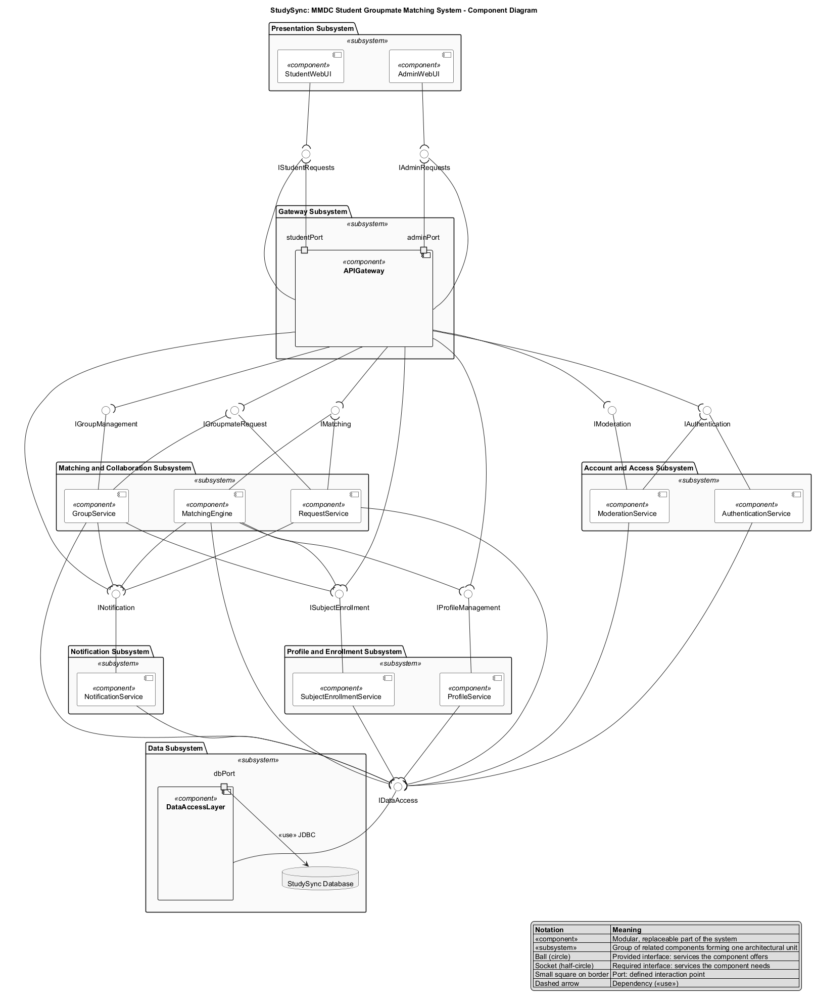

# 

# High-Level Project Structural Analysis of StudySync

Prepared and Presented by:

***Colin Bactong***  
***Angelica Mae Calipayan***  
***Charlize Bactong***  
***Chelsie Mae Ricafrente***  
*Bachelor of Science in Information Technology*  
*1st term A.Y. 2026-2027*

# **TABLE OF CONTENTS**						   							   			   

**Section**											  
[Executive Summary](#executive-summary)  
[Project Overview](#project-overview)  
	[Problem Statement](#problem-statement)  
	[Project Objectives](#project-objectives)  
	[Major System Functions](#major-system-functions)  
[Component Analysis](#component-analysis)  
	[Component Identification](#component-identification)  
	[Component Diagram](#component-diagram)  
	[Component Interaction Analysis](#component-interaction-analysis)  
	[Architectural Decisions](#architectural-decisions)  
[Class Analysis](#class-analysis)  
	[Class Identification](#class-identification)  
	[Class Diagram](#class-diagram)  
	[Relationship Analysis](#relationship-analysis)  
	[Design Decisions](#design-decisions)  
[Structural Findings](#structural-findings)  
[Recommendations for Future Design Activities](#recommendations-for-future-design-activities)  
[References](#references)

# **Intellectual Property Notice**

This template is an exclusive property of **Mapua-Malayan Digital College** and is protected under **Republic Act No. 8293**, also known as the *Intellectual Property Code of the Philippines* (IP Code). It is provided solely for educational purposes within this course. Students may use this template to complete their tasks but may not **modify, distribute, sell, upload,** or **claim ownership** of the template itself. Such actions constitute copyright infringement under **Sections 172, 177, and 216** of the IP Code and may result in legal consequences. Unauthorized use beyond this course may result in legal or academic consequences.

Additionally, students must comply with the **Mapua-Malayan Digital College Student Handbook**, particularly with the following provisions:

* **Offenses Related to MMDC IT**:  
  * **Section 6.2** – Unauthorized copying of files  
  * **Section 6.8** – Extraction of protected, copyrighted, and/or confidential information by electronic means using MMDC IT infrastructure  
* **Offenses Related to MMDC Admin, IT, and Operations**:  
  * **Section 4.5** – Unauthorized collection or extraction of money, checks, or other instruments of monetary equivalent in connection with matters pertaining to MMDC

Violations of these policies may result in **disciplinary actions ranging from suspension to dismissal**, in accordance with the Student Handbook.

For permissions or inquiries, please contact MMDC-ISD at [isd@mmdc.mcl.edu.ph](mailto:isd@mmdc.mcl.edu.ph).

1. # **Executive Summary** {#executive-summary}

   Mapúa Malayan Digital College (MMDC) delivers its Bachelor of Science in Information Technology programs in a fully online environment. Many subjects require students to form a project group before beginning Milestone 1, but students have limited opportunities to interact outside their weekly synchronous session. A student must find classmates taking the same subject while accounting for differences in IT major, schedules, employment commitments, and preferred ways of collaborating. In practice this is resolved through informal messaging and personal connections, which is slow and often produces groups formed on immediate availability alone rather than on compatibility.

   **StudySync: MMDC Student Groupmate Matching System** is the proposed solution. It is a web-based platform on which a student creates a collaboration profile, selects the subject they need a group for, records their availability and work schedule, and indicates a preferred working or study style. The system compares these criteria against other students enrolled in the same subject, recommends compatible groupmates, and supports the full sequence of sending a request, accepting or declining it, forming a project group, and receiving notifications at each step.

   The primary users are MMDC students forming project groups for their subjects. Administrators are secondary users who maintain student accounts and subject records and review reported users or inappropriate activity. Faculty and mentors are indirect stakeholders, since earlier and more deliberate group formation reduces coordination problems later in a project.

   This structural analysis documents the static structure of the proposed system before implementation begins. It identifies the components that make up the architecture, the classes that hold the system's data and behavior, and the relationships and dependencies among them. Conducting the analysis at this stage confirms that the proposed scope is internally consistent and feasible within the academic term, exposes design risks while they are still inexpensive to correct, and establishes the structural baseline that the use case models, sequence diagrams, and prototype of Milestone 2 will build upon.

2. # **Project Overview** {#project-overview}

   This section summarizes the key information established in the approved project proposal: the problem StudySync addresses, the goals the team set for the system, and the primary functions the system is expected to provide. It provides the functional basis for the component and class analysis that follows.
   

   1. ## **Problem Statement** {#problem-statement}

      The problem addressed by this project is the **difficulty MMDC students experience when finding compatible groupmates** for subject-based academic projects.

      Because MMDC is a fully online college, students have limited opportunities to interact with classmates outside their scheduled synchronous sessions. A student may know only a small number of people taking the same subject, and potential groupmates may have different IT majors, class schedules, employment commitments, skill sets, or preferred ways of collaborating. The difficulty is most acute during the initial group-formation stage, when students must form a project group before starting Milestone 1.

      Relying on informal communication makes this slow. A student may have to ask classmates individually whether they are still looking for a group, whether their schedules align, and whether they are comfortable with a particular working arrangement. Many MMDC students are also working while studying, so two students in the same subject may still be unable to collaborate if their available hours do not overlap. A student available only in the evenings because of work and a student who prefers afternoon collaboration face a real scheduling conflict even when both are willing.

      The problem matters because it delays the start of project work and pushes students toward groups formed on immediate availability rather than on compatibility. Differences in schedule, employment, academic background, and working style then make coordination harder once the project is underway. Those affected are MMDC students generally, and working students in particular, whose employment schedules restrict when they can participate in group activities.

   

   2. ## **Project Objectives** {#project-objectives}

   The main goal of StudySync is to provide MMDC students with a centralized platform for finding compatible groupmates for subject-based academic projects, so that group formation becomes a structured process rather than an informal search. The system organizes that process around relevant academic and collaboration factors: subject enrollment, IT major, availability, employment status and work schedule, and preferred study or working style.

   The specific objectives of the project are to:

   1. Allow students to create a study and collaboration profile containing their IT major, subjects, availability, employment status, work schedule where applicable, and preferred working or study style.
   2. Allow students to identify potential groupmates taking the same subject who have compatible availability, employment schedules, or collaboration preferences.
   3. Provide a matching mechanism that recommends potential groupmates based on selected compatibility criteria.
   4. Allow students to send and manage groupmate requests, including accepting or declining them.
   5. Allow students to organize a project group once compatible students agree to work together.
   6. Provide notifications and status updates for relevant matching and group-formation activities.
   7. Provide administrators with basic management capabilities for maintaining system information and handling user-related concerns.

   The objectives are considered achieved when the system can demonstrate the complete process from student profile creation, through groupmate discovery, matching, request, and acceptance, to project group formation. Success is measured by students spending less time manually searching for groupmates and having a more structured way of forming suitable project teams.

   

   3. ## **Major System Functions** {#major-system-functions}

   The system provides the following primary functions, derived from the functional requirements of the approved proposal.

| Function | Description |
| ----- | ----- |
| Student Account Management | Allows a student to register an account, log in and log out, and maintain basic profile information such as name and email address. |
| Collaboration Profile Management | Allows a student to select their IT major, set their available days and times, specify whether they are a working or full-time student, provide a typical work schedule where applicable, indicate a preferred study or working style, and update this information over time. |
| Subject Selection and Enrollment | Allows a student to select the subjects they are taking and indicate, per subject, whether they are currently looking for a group. |
| Groupmate Matching | Identifies other students enrolled in the same subject, compares the selected compatibility criteria, computes a compatibility score, and displays ranked potential groupmates along with the relevant parts of their profiles. |
| Groupmate Requests | Allows a student to send a groupmate request for a subject, receive incoming requests, accept or decline them, cancel a pending request, and view the status of each request. |
| Project Group Formation | Allows students who have agreed to collaborate to create a project group for a subject, add or accept members, view the group roster, and view basic group information. |
| Notifications | Notifies students of new groupmate requests, accepted or declined requests, group invitations, and other relevant group updates. |
| System Administration | Allows administrators to manage student accounts, maintain the list of subjects and other system information, and review reported users or inappropriate activity. |

3. # **Component Analysis** {#component-analysis}

   This section examines the high-level architecture of the proposed system. StudySync is organized as a web-based application with three layers: a browser presentation layer, an application layer of cooperating service components, and a shared data layer. Each component groups the classes that share a single responsibility, so the architecture maps directly onto the class model presented in the next section.
   

   1. ## **Component Identification** {#component-identification}

      The system is composed of the following thirteen components.

| Component | Responsibility |
| ----- | ----- |
| `StudentWebUI` | Browser-based interface used by students to register, manage their collaboration profile, select subjects, view potential groupmates, send or respond to requests, join project groups, and read notifications. Presents the behavior of the `Student` class. |
| `AdminWebUI` | Browser-based interface used by administrators to manage student accounts, maintain subjects, and review reported users or inappropriate activity. Presents the behavior of the `Administrator` class. |
| `APIGateway` | Single entry point for all browser requests. Handles routing, session validation, and dispatch to the correct application service, so the user interfaces do not depend on individual services directly. |
| `AuthenticationService` | Handles registration, login, logout, session issuance, account status, and role-based access control. Implements the shared behavior of the `User` class and distinguishes the `Student` and `Administrator` roles. |
| `ProfileService` | Creates and updates a student's collaboration profile, including IT major, employment status, work schedule, working-style preference, and available day and time ranges. Manages the `CollaborationProfile` and `Availability` classes. |
| `SubjectEnrollmentService` | Maintains the list of MMDC subjects and records which students are enrolled in each subject and whether they are currently looking for a group. Manages the `Subject` and `SubjectEnrollment` classes. |
| `MatchingEngine` | Filters eligible students in a subject, compares their profile information against predefined compatibility criteria, calculates a compatibility score, and produces ranked recommendations. Implements the `MatchingService` class and creates `MatchRecommendation` records. |
| `RequestService` | Manages groupmate requests between two students for a subject, including sending, accepting, declining, cancelling, and tracking request status. Manages the `GroupmateRequest` class. |
| `GroupService` | Creates project groups after students agree to collaborate, adds and removes members, and provides group membership and basic group information. Manages the `ProjectGroup` and `GroupMembership` classes. |
| `NotificationService` | Generates and delivers in-app updates about recommendations, groupmate requests, request responses, group invitations, and group changes. Manages the `Notification` class. |
| `ModerationService` | Accepts reports submitted by students about other users or inappropriate activity, stores them for review, and records the administrator's resolution. Manages the `UserReport` class. |
| `DataAccessLayer` | Provides a consistent persistence interface for all application services, translating domain objects into database operations and keeping query logic out of the service components. |
| `Database` | Stores all persistent system data, including accounts, collaboration profiles, availability, subjects, enrollments, recommendations, requests, groups, memberships, notifications, and reports. |

      These components are organized into six `«subsystem»` packages, each a collection of related components supporting one larger business function.

| Subsystem | Components | Business Function |
| ----- | ----- | ----- |
| Presentation | `StudentWebUI`, `AdminWebUI` | Browser-based user interaction |
| Gateway | `APIGateway` | Request routing and session validation |
| Account and Access | `AuthenticationService`, `ModerationService` | Account identity, access control, and moderation |
| Profile and Enrollment | `ProfileService`, `SubjectEnrollmentService` | Collaboration profiles and subject enrollment |
| Matching and Collaboration | `MatchingEngine`, `RequestService`, `GroupService` | Groupmate discovery, requests, and group formation |
| Notification | `NotificationService` | Delivery of in-app status updates |
| Data | `DataAccessLayer`, `Database` | Persistence of all system data |

      Each component publishes its services through a named interface, drawn ball-and-socket on the diagram.

| Interface | Provided By | Required By |
| ----- | ----- | ----- |
| `IStudentRequests` | `APIGateway` | `StudentWebUI` |
| `IAdminRequests` | `APIGateway` | `AdminWebUI` |
| `IAuthentication` | `AuthenticationService` | `APIGateway`, `ModerationService` |
| `IProfileManagement` | `ProfileService` | `APIGateway`, `MatchingEngine` |
| `ISubjectEnrollment` | `SubjectEnrollmentService` | `APIGateway`, `MatchingEngine`, `GroupService` |
| `IMatching` | `MatchingEngine` | `APIGateway`, `RequestService` |
| `IGroupmateRequest` | `RequestService` | `APIGateway`, `GroupService` |
| `IGroupManagement` | `GroupService` | `APIGateway` |
| `INotification` | `NotificationService` | `APIGateway`, `MatchingEngine`, `RequestService`, `GroupService` |
| `IModeration` | `ModerationService` | `APIGateway` |
| `IDataAccess` | `DataAccessLayer` | All eight application services |

      

   2. ## **Component Diagram** {#component-diagram}

*Figure: StudySync component diagram, drawn in standard UML component notation. Full-resolution versions are available as `StudySync_Component_Diagram.svg` and `StudySync_Component_Diagram.pdf`. The diagram is generated from the PlantUML source `StudySync_Component_Diagram.puml`.*

   3. ## **Component Interaction Analysis** {#component-interaction-analysis}

      The diagram is read through UML component notation. Every connection between components passes through a named interface drawn ball-and-socket: the full circle, or ball, marks the interface a component **provides**, and the open half-circle, or socket, marks the interface a component **requires**. Where a socket meets a ball the two form an assembly connector, meaning the required service is satisfied by the provided one. The small squares on the boundary of `APIGateway` and `DataAccessLayer` are ports, the defined interaction points through which those components expose or access their interfaces.

      All user interaction begins in the Presentation Subsystem. `StudentWebUI` and `AdminWebUI` run in the user's web browser and require `IStudentRequests` and `IAdminRequests`, the two interfaces provided by `APIGateway` through its `studentPort` and `adminPort`. Neither interface communicates with an application service directly, so the presentation layer depends only on the gateway. This keeps the browser code independent of how the services are internally organized.

      `APIGateway` requires `IAuthentication` and validates the session with `AuthenticationService` before forwarding any request that needs a signed-in user. It then dispatches the request to the responsible service through that service's provided interface, such as `IProfileManagement` for profile updates or `IMatching` for recommendation requests. `AuthenticationService` also supplies the user's role, which determines whether administrative operations in `ModerationService` and `SubjectEnrollmentService` are permitted.

      The matching flow contains the most significant dependencies between services. `MatchingEngine` requires both `IProfileManagement` and `ISubjectEnrollment`, which is visible on the diagram as two sockets reaching out of the Matching and Collaboration Subsystem. When a student requests potential groupmates, it reads collaboration profile information from `ProfileService` and subject enrollment information from `SubjectEnrollmentService`. It uses the enrollment records to restrict candidates to students taking the same subject who are marked as looking for a group, then compares IT major, availability, employment schedule, and working-style preference to compute a compatibility score. The resulting recommendations are returned to the student through the gateway.

      `RequestService` requires `IMatching` because a groupmate request normally originates from a displayed recommendation. `GroupService` requires `IGroupmateRequest` so that an accepted request can be used to establish a project group and create the corresponding membership records, and it also requires `ISubjectEnrollment` to verify that each member is enrolled in the group's subject.

      `NotificationService` is a shared provider rather than a caller. It provides a single interface, `INotification`, which `MatchingEngine`, `RequestService`, `GroupService`, and `APIGateway` all require. Because those components depend on the notification contract rather than on one another for messaging, notification behavior can change without affecting the matching or group-formation logic.

      On the administrative path, a student submits a report through `IModeration`, provided by `ModerationService`, which stores it for review. An administrator retrieves pending reports through `AdminWebUI` and records a resolution. When a resolution affects an account, `ModerationService` requires `IAuthentication` to update that account's status.

      Every application service requires `IDataAccess`, the single interface provided by `DataAccessLayer`. This is the most widely required interface in the architecture, with eight consuming components. `DataAccessLayer` then reaches `Database` through its `dbPort` as a `«use»` dependency, so no service accesses storage directly.

      Regarding external interfaces, StudySync deliberately has none beyond the web browser. It does not integrate with Coursera, MyCamu, Google Meet, or Google Workspace, and it does not read official MMDC enrollment records. Subject and account data are maintained within the system itself. This boundary is what keeps the project feasible within the academic term.

      These interactions support the project objectives directly. The profile and enrollment services satisfy the objective of capturing collaboration information; `MatchingEngine` reading from both satisfies the discovery and matching objectives; `RequestService` and `GroupService` satisfy the request-management and group-formation objectives; `NotificationService` satisfies the status-update objective; and `ModerationService` with `AuthenticationService` satisfies the administration objective. Together they deliver the complete flow from profile creation to project group formation.
      

   4. ## **Architectural Decisions** {#architectural-decisions}

      **Why the components were organized this way.** The components were derived by grouping classes according to shared responsibility rather than by screen or page. Each application component owns a small, closely related set of classes: `ProfileService` owns `CollaborationProfile` and `Availability`, `SubjectEnrollmentService` owns `Subject` and `SubjectEnrollment`, and `GroupService` owns `ProjectGroup` and `GroupMembership`. This keeps each component cohesive and makes the component boundaries match the boundaries already present in the class model. The three-layer arrangement was chosen because the proposal specifies a web-based system reachable from common desktop and mobile browsers, which implies a browser client separated from server-side logic and storage. Those three layers are expressed in the diagram as six `«subsystem»` packages, so that related components supporting one business function are enclosed together. `AuthenticationService` and `ModerationService` share the Account and Access Subsystem because both operate on accounts, while `APIGateway` was given its own subsystem because it mediates between the browser and every other subsystem rather than belonging to any one of them.

      Two components, `APIGateway` and `DataAccessLayer`, have no corresponding class in the class diagram. They were added because the proposal's non-functional requirements call for authentication, access control, and consistent data. The gateway gives the browser a single point of contact and one place to validate sessions, and the data access layer keeps persistence logic out of the individual services.

      **Assumptions made during analysis.** The architecture assumes a three-layer web deployment accessible from common browsers; that all StudySync data resides in a single system-owned database, since integration with official MMDC enrollment records is out of scope; that matching remains rule-based on predefined criteria rather than using an AI recommendation engine; and that notifications are delivered in-app rather than through external email or push services.

      **Alternative structures considered.** The team first considered a single monolithic application component containing all business logic, which was rejected because it hid the dependencies between matching, requests, and group formation that this analysis is meant to expose. The opposite extreme, one component per class, was also rejected as producing too many small units to be meaningful for a project of this size. A separate recommendation component was considered and merged into `MatchingEngine`, since a recommendation has no meaning apart from the matching process. Similarly, a dedicated invitation component was dropped because group membership can be established from an accepted groupmate request.

      **Significant challenges encountered.** The main challenge was choosing the right granularity for the application layer, which the team resolved by aligning components with the major system functions listed in Section 2.3. A second challenge was resisting scope creep toward functionality already provided by Coursera, MyCamu, Google Meet, and Google Workspace; file sharing, task management, grading, and class delivery were explicitly excluded from the architecture. A third was deciding where notification logic belongs, which was settled by making `NotificationService` a shared provider of one interface rather than letting each service notify users on its own.

      **Notation corrections applied after review.** An earlier version of the component diagram was drawn as a layered flowchart, with components shown as plain boxes and interface names written as text labels on the connecting arrows. That is not UML component notation. The diagram has been redrawn so that components carry the `«component»` stereotype and icon, related components are enclosed in `«subsystem»` packages, and each interface is modelled as a first-class element connected ball-and-socket to the components that provide and require it. Ports were added to `APIGateway` and `DataAccessLayer` to mark their explicit interaction points, and a legend on the diagram records the meaning of each symbol. Beyond correctness, drawing the sockets made the real coupling visible in a way the flowchart did not: `IDataAccess` is required by eight components and `INotification` by four, while `MatchingEngine` is the only service requiring two other business interfaces, which confirms it as the most coupled component in the system.

4. # **Class Analysis** {#class-analysis}

   1. ## **Class Identification** {#class-identification}

      The system is modeled using the following fourteen classes.

| Class | Responsibility |
| ----- | ----- |
| `User` | Provides the shared account information and authentication behavior used by students and administrators. |
| `Student` | Represents an MMDC student who creates a collaboration profile, looks for compatible groupmates, sends or receives requests, and joins project groups. |
| `Administrator` | Maintains users and subjects and reviews reports concerning users or inappropriate activity. |
| `CollaborationProfile` | Stores a student's IT major, employment status, work schedule, working-style preference, and other information used for matching. |
| `Availability` | Represents a day and time range during which a student is available for project collaboration. |
| `Subject` | Represents an MMDC subject for which students may look for groupmates and form a project group. |
| `SubjectEnrollment` | Connects a student to a subject and records whether the student is currently looking for a group in that subject. |
| `MatchingService` | Filters eligible students, compares their profile information, calculates compatibility, and produces recommendations. |
| `MatchRecommendation` | Records a potential groupmate suggested to a student for a particular subject, including the compatibility score and recommendation status. |
| `GroupmateRequest` | Represents a student's request to another student to collaborate for a particular subject and tracks its status. |
| `ProjectGroup` | Represents an agreed project team for one subject and stores its basic group information. |
| `GroupMembership` | Connects a student to a project group and records the member's role, join date, and membership status. |
| `Notification` | Provides a student with updates about recommendations, requests, invitations, membership, and other relevant group activity. |
| `UserReport` | Records a report submitted by a student about another user or inappropriate activity for administrator review. |

      Each class follows the standard UML member syntax. Attributes are written as `visibility name: Type` and are private by default, and every class provides a constructor together with public getter and setter operations for its attributes. Operations declare typed parameters and a return type, for example `+calculateCompatibility(studentId: int, candidateId: int): double`.

      Nine `«enumeration»` types supply the permitted values for the model's status and category attributes, replacing the free-text fields used in the first draft.

| Enumeration | Permitted Values |
| ----- | ----- |
| `AccountStatus` | ACTIVE, SUSPENDED, DEACTIVATED |
| `EmploymentStatus` | STUDENT_ONLY, PART_TIME, FULL_TIME |
| `WorkingStyle` | EARLY_STARTER, STEADY_PACER, DEADLINE_DRIVEN |
| `RecommendationStatus` | NEW, VIEWED, REQUESTED, DISMISSED |
| `RequestStatus` | PENDING, ACCEPTED, DECLINED, CANCELLED |
| `GroupStatus` | FORMING, ACTIVE, COMPLETED, DISBANDED |
| `MembershipRole` | LEADER, MEMBER |
| `NotificationType` | RECOMMENDATION, REQUEST_RECEIVED, REQUEST_RESPONSE, GROUP_INVITATION, GROUP_UPDATE |
| `ReportStatus` | PENDING, UNDER_REVIEW, RESOLVED, DISMISSED |

   2. ## **Class Diagram** {#class-diagram}

*Figure: StudySync class diagram, drawn in standard UML notation. Full-resolution versions are available as `StudySync_Class_Diagram.svg` and `StudySync_Class_Diagram.pdf`. The diagram is generated from the PlantUML source `StudySync_Class_Diagram.puml`.*

   3. ## **Relationship Analysis** {#relationship-analysis}

      **Inheritance and abstraction.** `Student` and `Administrator` are modeled as specialized forms of the abstract `User` class. Both share account details and authentication behavior, while each subclass adds the operations specific to its role. `User` is abstract because no account exists that is neither a student nor an administrator. This avoids duplicating common user data and gives `AuthenticationService` a single place to enforce role-based access. `MatchingService` acts as a service abstraction rather than an entity, holding matching behavior that belongs to no single student or profile.

      **Composition.** A `Student` has exactly one `CollaborationProfile`, and that profile contains zero or more `Availability` records. Both are compositions because the profile belongs exclusively to one student and the availability entries exist only as parts of that profile; deleting the student removes both. `ProjectGroup` likewise composes one or more `GroupMembership` records, so a group's roster cannot outlive the group. `Student` composes its `Notification` records for the same reason.

      **Associations and association classes.** The many-to-many relationship between students and subjects is resolved through `SubjectEnrollment`. One student may enroll in several subjects and one subject may include many students, and the association class stores the `lookingForGroup` flag that belongs to the pairing rather than to either side. `GroupMembership` resolves the many-to-many relationship between students and project groups in the same way, carrying the member's role and join status. Both are drawn using proper association class notation, as a dashed line from the class to the association path it describes, rather than as ordinary classes joined by two separate associations. `GroupmateRequest` is an association between two students, distinguished by the role names `sender` and `receiver`, and scoped to a subject.

      **Dependencies.** `MatchingService` depends on `CollaborationProfile` and `SubjectEnrollment` to find eligible candidates and compare their attributes, and it creates `MatchRecommendation` records. A recommendation may in turn initiate a `GroupmateRequest`. `GroupmateRequest` and `ProjectGroup` trigger `Notification` records, and `Administrator` depends on `User` and `Subject` for its management operations. Dependencies rather than associations were used here because these classes use one another transiently without holding a permanent reference.

      **How the relationships support the system functions.** The relationships trace directly onto the functions listed in Section 2.3. Profile management is supported by the `Student`-`CollaborationProfile`-`Availability` composition chain. Subject selection is supported by `SubjectEnrollment`, which also makes matching possible by identifying who is taking the same subject and still looking for a group. Matching is supported by the dependencies from `MatchingService` onto profile and enrollment data. Request handling is supported by the dual association of `GroupmateRequest` to sender and receiver. Group formation is supported by `ProjectGroup` composing `GroupMembership`. Notifications are supported by the trigger dependencies from requests and groups, and administration is supported by `UserReport` together with the administrator's management dependencies. Taken together, the relationships express the complete process from profile creation through matching and requests to project group formation.
      

   4. ## **Design Decisions** {#design-decisions}

      **Why the classes were selected.** The classes correspond to the system's major responsibilities rather than to individual screens or pages. Each was identified from the nouns in the approved proposal that carry data or behavior the system must track: students and administrators, profiles, availability, subjects, enrollments, recommendations, requests, groups, memberships, notifications, and reports. Classes that would exist only to display information were excluded.

      **How responsibilities were assigned.** Account behavior is centralized in `User` so that login, logout, and account status are defined once. `CollaborationProfile` is kept separate from `Student` so that matching-related information can change without touching identity or login data. Behavior that belongs to a relationship rather than to an entity was pushed into association classes, which is why `lookingForGroup` sits on `SubjectEnrollment` and `role` sits on `GroupMembership`. Behavior that belongs to no single entity was placed in `MatchingService`, since calculating compatibility across many students is system behavior rather than the responsibility of one student or profile.

      **Significant design choices.** `Availability`, `SubjectEnrollment`, and `GroupMembership` were modeled as classes instead of plain attributes because each represents a repeating relationship with its own data; collapsing them into fields would have lost multiplicity. Employment status and typical work schedule remain in `CollaborationProfile` because they describe the student's general circumstances, while `Availability` represents the specific times the student chooses for collaboration. `MatchRecommendation` was retained as its own class so a compatibility score and recommendation status can be stored and revisited. A separate invitation class was not created, since adding a member can proceed from an accepted `GroupmateRequest`. `Notification` uses a general `type` attribute rather than a subclass per event, which keeps the model compact while still covering every notification listed in the proposal.

      **Assumptions made during modeling.** The model assumes that students enter accurate profile and enrollment information; that each student has exactly one collaboration profile; that each project group is associated with exactly one subject; that only students marked as looking for a group are eligible for recommendations; and that account and subject data are maintained inside StudySync, because direct access to official MMDC enrollment systems is outside the project's scope. Matching is assumed to be rule-based on predefined criteria rather than driven by an AI recommendation engine.

      **Challenges.** The principal challenge was balancing a sufficiently detailed model against the limited academic term. Functionality belonging to Coursera, MyCamu, Google Meet, and Google Workspace, along with project task management, file sharing, grading, and class delivery, was deliberately excluded. A second challenge was deciding how much behavior to place on entity classes versus the service class, which the team resolved by keeping entity operations limited to their own state and assigning cross-entity computation to `MatchingService`.

      **Notation corrections applied after review.** The classes themselves were identified correctly in the first draft, but their members were written incorrectly. Attributes appeared as `+String userId`, placing the type before the name and defaulting to public visibility. UML specifies the opposite order, `visibility name: type-expression`, so the attribute is now `-userId: int`, private and typed after the name. Operations follow the matching form `visibility name(parameter-list): return-type`, as in `+login(email: String, password: String): boolean`. Every attribute in all fourteen classes was rewritten accordingly.

      **Encapsulation members added.** The first draft also omitted constructors and accessors. Each class now declares a constructor that takes the attributes required at creation time, together with a public getter and setter for every attribute, with boolean attributes using the `isX()` form. Because these members make each class box considerably taller, the diagram separates them into labelled compartments for Constructor, Accessors, and Operations, so that the behavior specific to each class stays easy to find.

      **Enumerations introduced.** The status and category attributes previously held free text, which left their permitted values undefined. Nine enumerations now supply those values and are referenced directly as attribute types, which both documents the valid states and removes a class of data-entry error.

5. # **Structural Findings** {#structural-findings}

   **How the components and classes work together.** The two models describe the same system at different levels of detail, and they align cleanly. Every one of the fourteen classes is owned by exactly one application component, and no class is split across components. The component view shows the flow of control, from browser through gateway to service to database, while the class view shows the data and behavior each service operates on. The two meet most visibly in the matching flow: the component diagram shows `MatchingEngine` depending on `ProfileService` and `SubjectEnrollmentService`, and the class diagram explains why, since `MatchingService` must read `CollaborationProfile`, `Availability`, and `SubjectEnrollment` to compute a compatibility score. Reading the models together confirms that each major system function in Section 2.3 has both a component responsible for it and the classes needed to carry it out.

   **Strengths of the proposed structure.** The layered arrangement keeps the browser client independent of service organization, so the user interface can change without rippling into business logic. Cohesion is high because each component owns a closely related group of classes, and coupling is limited because services reach one another only where a genuine data dependency exists. Centralizing authentication in one component and persistence in another means security and data-consistency requirements are enforced in a single place rather than repeated. The use of association classes preserves information that would otherwise be lost, and the event-based treatment of `NotificationService` prevents messaging concerns from spreading through the rest of the system. The scope is also disciplined: the structure covers the full group-formation process without duplicating functionality that Coursera, MyCamu, Google Meet, or Google Workspace already provide.

   **Potential risks and limitations.** The most significant risk is that matching quality depends entirely on self-reported data. If students enter inaccurate or incomplete availability, employment, or working-style information, the compatibility scores will be unreliable no matter how the structure is designed. A second risk is that `MatchingEngine` depends on two other services, making it the most coupled component in the architecture and the one most affected by changes to profile or enrollment data. Third, the compatibility algorithm itself is not specified by the structural model; the class diagram shows that `calculateCompatibility` exists but not how it weighs major, availability, and working style, and that weighting will materially affect whether students find the recommendations useful. Fourth, keeping notifications in-app means a student who does not log in will not learn about a pending request, which could stall group formation. Finally, maintaining subject and account data inside StudySync rather than reading MMDC records means the data can drift out of step with actual enrollment.

   **Areas requiring further refinement.** Four areas need more work before implementation. The compatibility scoring rules and their weighting must be defined concretely, including how partial availability overlap is scored. The lifecycle of `GroupmateRequest` and `ProjectGroup` needs to be specified: the `RequestStatus` and `GroupStatus` enumerations now fix the permitted values, but the transitions between them, and the conditions that trigger each transition, still belong to the state modeling work of Milestone 2. Group capacity rules need clarification, particularly what happens when accepting a request would exceed `maximumMembers`, and whether a student may belong to more than one group for the same subject. The moderation workflow also needs detail on what resolutions an administrator can apply and how each affects an account's status.

6. # **Recommendations for Future Design Activities** {#recommendations-for-future-design-activities}

   The structural analysis produces the static foundation that the behavioral work of Milestone 2 will build on. Each of the following activities can begin directly from artifacts established here.

   **Use Case Modeling.** The actors are already identified by the inheritance hierarchy and the presentation layer: `Student` and `Administrator` inherit from `User`, and `StudentWebUI` and `AdminWebUI` mark the boundary between those actors and the system. The eight functions in Section 2.3 map to candidate use cases such as Manage Collaboration Profile, Find Potential Groupmates, Send Groupmate Request, Respond to Groupmate Request, Form Project Group, and Review Reported User. Because StudySync has no external system interfaces, the use case diagram will have a single clean system boundary.

   **Sequence Diagrams.** The component interactions documented in Section 3.3 identify the flows most worth modeling. Highest priority is Find Potential Groupmates, which involves `StudentWebUI`, `APIGateway`, `AuthenticationService`, `MatchingEngine`, `ProfileService`, and `SubjectEnrollmentService`, since it has the deepest dependency chain in the architecture. Second is the request-to-group sequence, from `RequestService` accepting a request through `GroupService` creating the group and `NotificationService` informing both students. The operations already declared on the classes, such as `generateRecommendations`, `accept`, and `addMember`, provide the messages for these diagrams, so the sequence work becomes a matter of ordering existing operations rather than inventing new ones.

   **Prototype Development.** The three-layer separation means the presentation layer can be prototyped against defined service interfaces before the services are fully implemented. Prototyping should begin with the screens that carry the most design risk: collaboration profile creation, including how availability is entered, and the potential groupmates list, since how compatibility is presented determines whether students trust the recommendations. The attributes listed on `CollaborationProfile` and `Availability` give a concrete field list for the profile form.

   **Behavioral Analysis.** The `status` attributes on `GroupmateRequest`, `ProjectGroup`, `GroupMembership`, `MatchRecommendation`, and `UserReport` are natural candidates for state machine diagrams, and modeling them will resolve the lifecycle gaps identified in Section 5. The enumerations already supply the state names, so the remaining work is to define the transitions between them. The `RequestStatus` lifecycle of PENDING, ACCEPTED, DECLINED, and CANCELLED is the most important, since it governs whether a project group can be formed. Activity diagrams for the end-to-end group-formation process will also help confirm that the component and class structures support the complete flow under alternative paths, such as a declined request or a group that reaches capacity.

   Taken together, these activities extend the static structure documented here into the dynamic behavior required for Milestone 2. The classes, components, and relationships defined in this analysis provide the vocabulary those models will use, and the open questions raised in Section 5 provide their starting agenda.

7. # **References** {#references}

   The following team documents were used to prepare this structural analysis.

| Reference No | Reference Title |
| :---: | ----- |
| 1 | Team-Selected Project Proposal — *\<paste link\>* |
| 2 | Project Class Diagram — *\<paste link\>* |
| 3 | Project Component Diagram — *\<paste link\>* |

