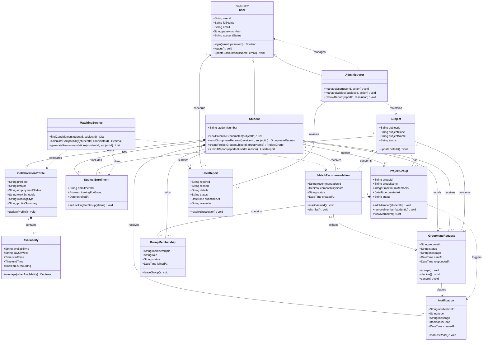

# **Intellectual Property Notice**

This template is an exclusive property of **Mapua-Malayan Digital College** and is protected under **Republic Act No. 8293**, also known as the *Intellectual Property Code of the Philippines* (IP Code). It is provided solely for educational purposes within this course. Students may use this template to complete their tasks but may not **modify, distribute, sell, upload,** or **claim ownership** of the template itself. Such actions constitute copyright infringement under **Sections 172, 177, and 216** of the IP Code and may result in legal consequences. Unauthorized use beyond this course may result in legal or academic consequences.

Additionally, students must comply with the **Mapua-Malayan Digital College Student Handbook**, particularly with the following provisions:

- **Offenses Related to MMDC IT**:  
  - **Section 6.2** – Unauthorized copying of files  
  - **Section 6.8** – Extraction of protected, copyrighted, and/or confidential information by electronic means using MMDC IT infrastructure
- **Offenses Related to MMDC Admin, IT, and Operations**:  
  - **Section 4.5** – Unauthorized collection or extraction of money, checks, or other instruments of monetary equivalent in connection with matters pertaining to MMDC

Violations of these policies may result in **disciplinary actions ranging from suspension to dismissal**, in accordance with the Student Handbook.

For permissions or inquiries, please contact MMDC-ISD at [isd@mmdc.mcl.edu.ph](mailto:isd@mmdc.mcl.edu.ph). 

| MO-IT115 Object-Oriented System Analysis & Design |     |
| ------------------------------------------------- | --- |
| Project Class Diagram                             |     |

| Milestone 1 Team Leader     | Colin Bactong                                    |
| --------------------------- | ------------------------------------------------ |
| **Members:**                | Angelica Mae Calipayan                           |
|                             | Chelsie Mae Ricafrente                           |
|                             | Charlize Bactong                                 |
| **Program and Year Level:** | BSIT Marketing Technology & Software Development |

## 1. Project Context

**StudySync: MMDC Student Groupmate Matching System** is a web-based platform designed to help Mapúa Malayan Digital College (MMDC) students find compatible groupmates for subject-based academic projects. It addresses the difficulty of forming groups in a fully online learning environment, where students may have limited opportunities to meet classmates and may differ in IT major, availability, employment schedule, and preferred way of working.

The primary users are MMDC students who need to form project groups. System administrators are secondary users who maintain student accounts and subject information and review reported users or inappropriate activity.

The system allows students to register and maintain a collaboration profile, select their subjects, provide their availability and work schedule, indicate their preferred working style, and receive potential groupmate recommendations. Students can send, accept, or decline groupmate requests, form project groups, view group membership, receive notifications, and report inappropriate activity. StudySync focuses on group formation and does not replace Coursera, MyCamu, Google Meet, Google Workspace, or other existing MMDC platforms.

## 2. Class Identification

| Class Name             | Purpose/Responsibility                                                                                                                                 |
| ---------------------- | ------------------------------------------------------------------------------------------------------------------------------------------------------ |
| `User`                 | Provides the shared account information and authentication behavior used by students and administrators.                                               |
| `Student`              | Represents an MMDC student who creates a collaboration profile, looks for compatible groupmates, sends or receives requests, and joins project groups. |
| `Administrator`        | Maintains users and subjects and reviews reports concerning users or inappropriate activity.                                                           |
| `CollaborationProfile` | Stores a student's IT major, employment status, work schedule, working-style preference, and other information used for matching.                      |
| `Availability`         | Represents a day and time range during which a student is available for project collaboration.                                                         |
| `Subject`              | Represents an MMDC subject for which students may look for groupmates and form a project group.                                                        |
| `SubjectEnrollment`    | Connects a student to a subject and records whether the student is currently looking for a group in that subject.                                      |
| `MatchingService`      | Filters eligible students, compares their profile information, calculates compatibility, and produces recommendations.                                 |
| `MatchRecommendation`  | Records a potential groupmate suggested to a student for a particular subject, including the compatibility score and recommendation status.            |
| `GroupmateRequest`     | Represents a student's request to another student to collaborate for a particular subject and tracks its status.                                       |
| `ProjectGroup`         | Represents an agreed project team for one subject and stores its basic group information.                                                              |
| `GroupMembership`      | Connects a student to a project group and records the member's role, join date, and membership status.                                                 |
| `Notification`         | Provides a student with updates about recommendations, requests, invitations, membership, and other relevant group activity.                           |
| `UserReport`           | Records a report submitted by a student about another user or inappropriate activity for administrator review.                                         |

## 3. Class Diagram

## 4. Relationship Analysis

The diagram uses **inheritance** to model `Student` and `Administrator` as specialized forms of the abstract `User` class. Both user types share account details and authentication behavior, while each subclass has responsibilities specific to its role. This avoids duplicating common user data and makes role-based behavior clear.

A `Student` has exactly one `CollaborationProfile`, and the profile contains zero or more `Availability` records. These are **composition relationships** because the profile belongs exclusively to a student, and availability entries exist as parts of that profile. Separating availability into individual records lets the system represent multiple collaboration schedules instead of storing a single unstructured value.

The many-to-many relationship between students and subjects is resolved through `SubjectEnrollment`. One student may enroll in several subjects, and one subject may include many students. The association class also stores whether the student is actively looking for a group, allowing `MatchingService` to exclude students who are not currently available for matching.

`MatchingService` depends on `CollaborationProfile` and `SubjectEnrollment` to find eligible students and compare major, availability, employment schedule, and working-style information. It creates `MatchRecommendation` records for a student and subject. A recommendation may lead to a `GroupmateRequest`, which associates one sender and one receiver with the relevant subject and records whether the request is pending, accepted, declined, or cancelled.

Each `ProjectGroup` belongs to one `Subject` and is created by one student. Its members are represented by `GroupMembership`, which resolves the many-to-many relationship between students and groups and stores group-specific information such as role and join status. The group composes one or more membership records so that its roster can be managed consistently.

A student owns notifications generated by request and group events. Students may also submit `UserReport` records concerning a user, and an administrator may review and resolve those reports. Administrators additionally depend on `User` and `Subject` to perform the basic management functions defined in the proposal.

Together, these relationships support StudySync's main process: identify students taking the same subject, compare their collaboration profiles, recommend compatible groupmates, manage requests, form a project group, and communicate relevant status changes.

## 5. Design Decisions

The selected classes correspond directly to the system's major responsibilities rather than to individual screens or pages. Account behavior is centralized in the abstract `User` class, while inheritance separates student actions from administrative actions. `CollaborationProfile` is separate from `Student` so matching-related information can change without affecting identity and login information.

`Availability`, `SubjectEnrollment`, and `GroupMembership` were modeled as separate classes instead of simple attributes. A student may have several available time ranges, take several subjects, and belong to project groups, so these classes preserve multiplicity and store information specific to each relationship. Employment status and the typical work schedule remain in `CollaborationProfile` because they describe the student's general circumstances, while `Availability` represents the times the student chooses for collaboration.

`MatchingService` was modeled as a service class because compatibility calculation is system behavior rather than a responsibility of one student or profile. `MatchRecommendation` is retained as a domain class so the system can store a compatibility score and recommendation status. However, the matching method is intentionally rule-based and uses predefined criteria; no AI recommendation engine is assumed.

`GroupmateRequest` handles the initial agreement between two students, while `ProjectGroup` and `GroupMembership` handle the resulting team's structure. A separate invitation class was not included to keep the model within the proposal's scope; adding a member can use an accepted groupmate request and generate a notification. Similarly, notifications use a general `type` field rather than separate subclasses for every notification event.

The model assumes that students enter accurate profile and enrollment information, one collaboration profile belongs to each student, each project group is associated with one subject, and only students marked as looking for a group are eligible for recommendations. It also assumes that account and subject data are maintained within StudySync because direct access to official MMDC enrollment systems is outside the project's scope.

The main analysis challenge was balancing a detailed model with the project's limited academic-term scope. Features belonging to Coursera, MyCamu, Google Meet, Google Workspace, project-task management, file sharing, grading, and class delivery were therefore excluded. The resulting diagram focuses on the complete required flow from profile creation and subject selection through matching, requests, group formation, notifications, and basic administration.