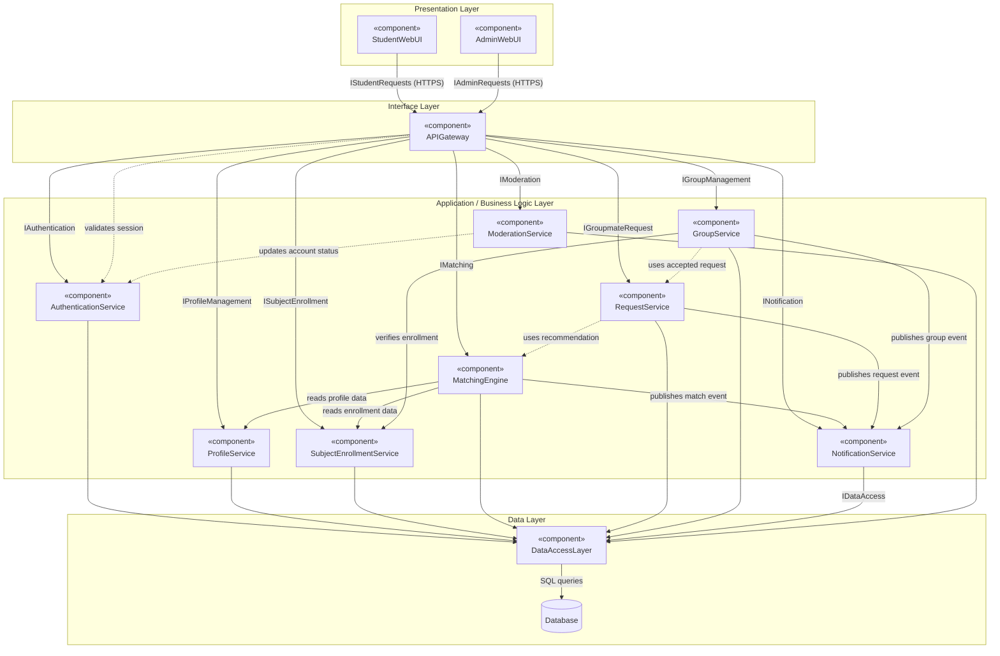

# **Intellectual Property Notice**

This template is an exclusive property of **Mapua-Malayan Digital College** and is protected under **Republic Act No. 8293**, also known as the *Intellectual Property Code of the Philippines* (IP Code). It is provided solely for educational purposes within this course. Students may use this template to complete their tasks but may not **modify, distribute, sell, upload,** or **claim ownership** of the template itself. Such actions constitute copyright infringement under **Sections 172, 177, and 216** of the IP Code and may result in legal consequences. Unauthorized use beyond this course may result in legal or academic consequences.

Additionally, students must comply with the **Mapua-Malayan Digital College Student Handbook**, particularly with the following provisions:

- **Offenses Related to MMDC IT**:  
  - **Section 6.2** – Unauthorized copying of files  
  - **Section 6.8** – Extraction of protected, copyrighted, and/or confidential information by electronic means using MMDC IT infrastructure
- **Offenses Related to MMDC Admin, IT, and Operations**:  
  - **Section 4.5** – Unauthorized collection or extraction of money, checks, or other instruments of monetary equivalent in connection with matters pertaining to MMDC

Violations of these policies may result in **disciplinary actions ranging from suspension to dismissal**, in accordance with the Student Handbook.

For permissions or inquiries, please contact MMDC-ISD at [isd@mmdc.mcl.edu.ph](mailto:isd@mmdc.mcl.edu.ph). 

| MO-IT115 Object-Oriented System Analysis & Design |     |
| ------------------------------------------------- | --- |
| Project Component Diagram                         |     |

| Milestone 1 Team Leader     | Colin Bactong                                                                     |
| --------------------------- | --------------------------------------------------------------------------------- |
| **Members:**                | Charlize Bactong                                                                  |
|                             | Angelica Mae Calipayan                                                            |
|                             | Chelsie Mae Ricafrente                                                            |
| **Program and Year Level:** | 3rd Year BSIT Major in Software Development, Marketing Technology & Cybersecurity |

## 1. Component Identification

**StudySync: MMDC Student Groupmate Matching System** is organized as a web-based application with a browser presentation layer, an application layer of cooperating service components, and a shared data layer. Each component groups the classes from the class diagram that share a single responsibility.

| Component Name             | Purpose/Responsibility                                                                                                                                                                                                                                                         |
| -------------------------- | ------------------------------------------------------------------------------------------------------------------------------------------------------------------------------------------------------------------------------------------------------------------------------ |
| `StudentWebUI`             | Browser-based interface used by students to register, manage their collaboration profile, select subjects, view potential groupmates, send or respond to requests, join project groups, and read notifications. Presents the behavior of the `Student` class.                  |
| `AdminWebUI`               | Browser-based interface used by administrators to manage student accounts, maintain subjects, and review reported users or inappropriate activity. Presents the behavior of the `Administrator` class.                                                                         |
| `APIGateway`               | Single entry point for all browser requests. Handles routing, session validation, and dispatch to the correct application service, so the user interfaces do not depend on individual services directly.                                                                       |
| `AuthenticationService`    | Handles registration, login, logout, session issuance, account status, and role-based access control. Implements the shared behavior of the `User` class and distinguishes the `Student` and `Administrator` roles.                                                            |
| `ProfileService`           | Creates and updates a student's collaboration profile, including IT major, employment status, work schedule, working-style preference, and available day and time ranges. Manages the `CollaborationProfile` and `Availability` classes.                                       |
| `SubjectEnrollmentService` | Maintains the list of MMDC subjects and records which students are enrolled in each subject and whether they are currently looking for a group. Manages the `Subject` and `SubjectEnrollment` classes.                                                                         |
| `MatchingEngine`           | Filters eligible students in a subject, compares their profile information against predefined compatibility criteria, calculates a compatibility score, and produces ranked recommendations. Implements the `MatchingService` class and creates `MatchRecommendation` records. |
| `RequestService`           | Manages groupmate requests between two students for a subject, including sending, accepting, declining, cancelling, and tracking request status. Manages the `GroupmateRequest` class.                                                                                         |
| `GroupService`             | Creates project groups after students agree to collaborate, adds and removes members, and provides group membership and basic group information. Manages the `ProjectGroup` and `GroupMembership` classes.                                                                     |
| `NotificationService`      | Generates and delivers in-app updates about recommendations, groupmate requests, request responses, group invitations, and group changes. Manages the `Notification` class.                                                                                                    |
| `ModerationService`        | Accepts reports submitted by students about other users or inappropriate activity, stores them for review, and records the administrator's resolution. Manages the `UserReport` class.                                                                                         |
| `DataAccessLayer`          | Provides a consistent persistence interface for all application services, translating domain objects into database operations and keeping query logic out of the service components.                                                                                           |
| `Database`                 | Stores all persistent system data, including accounts, collaboration profiles, availability, subjects, enrollments, recommendations, requests, groups, memberships, notifications, and reports.                                                                                |

## 2. Component Diagram

## 3. Component Interaction Analysis

All user interaction begins in the presentation layer. `StudentWebUI` and `AdminWebUI` run in the student's or administrator's web browser and send requests over HTTPS to `APIGateway`. Neither interface communicates with an application service directly, so the presentation layer depends only on the gateway. This keeps the browser code independent of how the services are internally organized.

`APIGateway` validates the session with `AuthenticationService` before forwarding any request that requires a signed-in user. It then dispatches the request to the responsible service through a named interface, such as `IProfileManagement` for profile updates or `IMatching` for recommendation requests. `AuthenticationService` also supplies the user's role, which determines whether administrative operations in `ModerationService` and `SubjectEnrollmentService` are permitted.

The matching flow shows the most significant dependencies between services. When a student requests potential groupmates, `MatchingEngine` reads collaboration profile information from `ProfileService` and subject enrollment information from `SubjectEnrollmentService`. It uses the enrollment records to restrict candidates to students taking the same subject who are marked as looking for a group, then compares IT major, availability, employment schedule, and working-style preference to compute a compatibility score. The resulting recommendations are returned to the student through the gateway.

`RequestService` depends on `MatchingEngine` because a groupmate request usually originates from a displayed recommendation. Once a request is accepted, `GroupService` uses that accepted request to establish a project group and create the corresponding membership records, and it verifies with `SubjectEnrollmentService` that each member is enrolled in the group's subject.

`NotificationService` is a shared consumer rather than a caller. `MatchingEngine`, `RequestService`, and `GroupService` publish events to it whenever recommendations are generated, requests are sent or answered, or group membership changes. Because these components depend on `NotificationService` rather than on one another for messaging, notification behavior can change without affecting the matching or group-formation logic.

On the administrative path, a student submits a report through `ModerationService`, which stores it for review. An administrator retrieves pending reports through `AdminWebUI` and records a resolution. When a resolution affects an account, `ModerationService` asks `AuthenticationService` to update that account's status.

Every application service persists and retrieves data through `DataAccessLayer`, which in turn executes queries against `Database`. No service accesses the database directly. Together these interactions support the system's complete flow: account creation, profile and subject setup, groupmate discovery, requests, group formation, notifications, and administration.

## 4. Architectural Decisions

The components were selected by grouping the classes from the class diagram according to shared responsibility rather than by screen or page. Each application component owns a small, closely related set of classes: `ProfileService` owns `CollaborationProfile` and `Availability`, `SubjectEnrollmentService` owns `Subject` and `SubjectEnrollment`, `GroupService` owns `ProjectGroup` and `GroupMembership`, and so on. This keeps each component cohesive and makes the boundary between components match the boundaries already established in the class model.

The class diagram directly influenced the structure in several places. `MatchingService` was already modeled as a service class rather than a domain entity, so it became the separate `MatchingEngine` component. The association classes `SubjectEnrollment` and `GroupMembership` were kept inside the components that own their parent classes, because they exist only to connect a student to a subject or a group. The inheritance of `Student` and `Administrator` from the abstract `User` class is handled entirely within `AuthenticationService`, which is why role checking is centralized there instead of being repeated in each service.

Several components were deliberately combined or simplified. `MatchingEngine` also produces and stores `MatchRecommendation` records instead of a separate recommendation component, since a recommendation has no meaning apart from the matching process. `NotificationService` handles all notification types through one component rather than separate components per event, matching the class diagram's decision to use a general `type` field. A separate invitation component was not created, because group membership is established from an accepted groupmate request. Likewise, no external email or push-delivery component is included, since notifications are kept in-app and within the project's scope.

`APIGateway` and `DataAccessLayer` were added even though they have no matching class in the class diagram. The gateway gives the browser a single point of contact and a consistent place for session validation, while the data access layer keeps persistence logic out of the individual services. Both reflect the proposal's non-functional requirements for security and reliability.

The architecture assumes a three-layer web deployment accessible from common desktop and mobile browsers, as stated in the proposal's Compatibility requirement. It also assumes that all StudySync data is stored in a single system-owned database, because direct integration with official MMDC enrollment records is outside the project's scope, and that matching remains rule-based on predefined criteria rather than an AI recommendation engine.

The main challenge during the analysis was deciding how finely to divide the application layer. An earlier grouping placed matching, requests, and group formation in one large component, which hid the dependencies between them, while dividing every class into its own component produced too many small pieces for an academic-term project. The final set balances the two by keeping components aligned with the major functions defined in the proposal. A related challenge was avoiding scope creep toward features already provided by Coursera, MyCamu, Google Meet, and Google Workspace; those responsibilities were intentionally excluded from the architecture.

## 5. Project Resources

| Resource Name         |     Reference     |
| --------------------- | :---------------: |
| Team Project Proposal | *\<paste link\>*  |
| Class Diagram         | *\<paste link\>*  |

